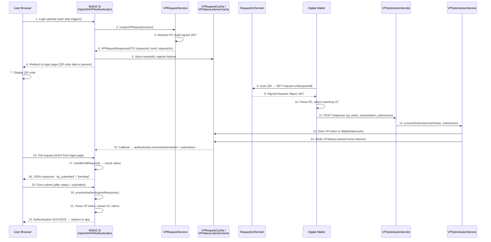

# OpenID4VP Authentication Workflow

## Overview

The `OpenID4VPAuthenticator` integrates with WSO2 IS's **Authentication Framework** as a federated authenticator. When a user attempts to log in to an application that has OpenID4VP configured as an authentication step, this authenticator orchestrates a credential presentation flow where the user presents Verifiable Credentials from a digital wallet.

---

## End-to-End Sequence



---

## Phase 1: Initiation — `initiateAuthenticationRequest()`

**File:** `authenticator/OpenID4VPAuthenticator.java` (lines 150–193)

**Steps:**

1. **Create VP Request** — Calls `createVPRequest(context)` which internally:
   - Reads `didMethod` and `signingAlgorithm` from the authenticator properties (configured per-Connection).
   - Resolves the `PresentationDefinition` by looking up the Connection's `resourceId` via `PresentationDefinitionService.getPresentationDefinitionByResourceId()`.
   - Builds a `VPRequestCreateDTO` with nonce, response URI, response mode (`direct_post`), and the resolved PD.
   - Delegates to `VPRequestService.createVPRequest()` which generates a `requestId`, `transactionId`, builds a **signed JWT Request Object** (via `buildRequestObjectJwt`), stores the request in `VPRequestCache`, and returns a `VPRequestResponseDTO`.

2. **Register Status Listener** — Registers `this` authenticator instance as a callback in `VPStatusListenerCache`, keyed by `requestId`. This enables **push-based notification** when the wallet submits.

3. **Redirect to Login Page** — Builds query parameters containing the QR code content (which encodes `request_uri` + `client_id`) and redirects the browser to the OpenID4VP login page.

---

## Phase 2: Wallet Interaction

### 2a. Fetch Request Object

The wallet scans the QR code, extracts the `request_uri`, and makes a `GET` request to:
```
/api/openid4vp/v1/request-uri/{requestId}
```

The `RequestUriServlet` resolves the request from cache and returns the **signed JWT Request Object**. The JWT contains:
- `client_id` — the verifier's DID
- `response_uri` — where the wallet should POST the response
- `response_mode` — `direct_post`
- `nonce` — for replay protection
- `presentation_definition` — what credentials are required
- `iss`, `aud`, `exp`, `iat` — standard JWT claims

### 2b. Submit VP Token

After the user selects and authorizes credentials in the wallet, it `POST`s to:
```
/api/openid4vp/v1/response
```

Parameters: `vp_token`, `presentation_submission`, `state`

The `VPSubmissionServlet` delegates to `VPSubmissionService.processSubmission()` which:
1. Stores the VP token and submission in `WalletDataCache`.
2. Updates the VP request status to `VP_SUBMITTED`.
3. **Notifies the registered listener** in `VPStatusListenerCache` — this pushes the `VPSubmission` object directly to the `OpenID4VPAuthenticator` instance via its callback, setting `receivedSubmission`.

---

## Phase 3: Polling — `handlePollRequest()`

**File:** `authenticator/OpenID4VPAuthenticator.java` (lines 465–514)

The login page polls IS via AJAX. The authenticator checks the VP request status:

| Status | Response | Flow Status |
|--------|----------|-------------|
| `PENDING` | `{"status":"pending"}` | `INCOMPLETE` |
| `VP_SUBMITTED` | `{"status":"vp_submitted"}` | `INCOMPLETE` |
| `COMPLETED` | `{"status":"completed"}` | `SUCCESS_COMPLETED` |
| `EXPIRED` | `{"status":"expired"}` | Throws `AuthenticationFailedException` |
| `CANCELLED` | `{"status":"cancelled"}` | Throws `AuthenticationFailedException` |

When the login page detects `vp_submitted`, it auto-submits the form to continue the auth flow.

---

## Phase 4: Response Processing — `processAuthenticationResponse()`

**File:** `authenticator/OpenID4VPAuthenticator.java` (lines 249–442)

This method is called when the authentication framework resumes after a successful poll. It processes the VP token received from the wallet:

### Step 1: Extract VP Token Format

Uses `extractVPTokenFormat()` which parses the `presentation_submission` JSON to get the `format` from the `descriptor_map` (DIF Presentation Exchange standard).

### Step 2: Parse VP Token by Format

| Format | Parsing Strategy |
|--------|-----------------|
| **`vc+sd-jwt`** | Split by `~` delimiter → decode issuer JWT payload |
| **`ldp_vp`** | Parse as raw JSON object |
| **`jwt_vp`** / **`jwt_vp_json`** | Split by `.` → Base64-decode payload |

### Step 3: Extract Verifiable Credentials

From the parsed VP, extracts the `verifiableCredential` array. For each VC:
- If it's a JWT string → decode payload → extract `credentialSubject`
- If it's an embedded JSON-LD VC → read `credentialSubject` directly

### Step 4: Extract User Identity

Looks for identity claims in priority order: `email` → `username` → `id` from the `credentialSubject`.

### Step 5: Set Authenticated User

Sets the authenticated user in the `AuthenticationContext`, completing the authentication step.

---

## Key Design Patterns

### Push + Poll Hybrid

The authenticator uses a **hybrid push-poll** pattern:
- **Push**: The `VPStatusListenerCache` delivers the `VPSubmission` directly to the authenticator instance via a callback, avoiding a database read.
- **Poll**: The browser polls for status changes via AJAX, providing a responsive UX.

### Cache-First Architecture

VP requests are stored in **in-memory caches** (`VPRequestCache`, `WalletDataCache`) rather than the database during the active authentication flow. This provides fast lookups during the time-sensitive QR-scan-and-submit workflow. Only persistent data (Presentation Definitions, DID keys) uses the database.

### Request Object by Reference

Instead of embedding the full request in the QR code, the system uses the `request_uri` pattern (OpenID4VP §5.8): the QR encodes a short URI, and the wallet fetches the full signed JWT from the `RequestUriServlet`. This keeps QR codes scannable.
