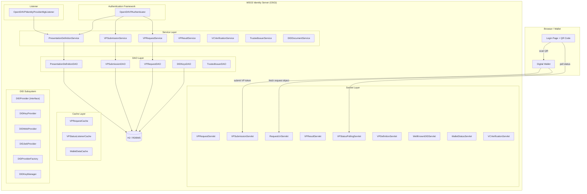

# OpenID4VP Presentation Component — Architecture & Codebase Overview

## 1. Component Identity

| Property | Value |
|----------|-------|
| **Module** | `org.wso2.carbon.identity.openid4vc.presentation` |
| **Root Package** | `org.wso2.carbon.identity.openid4vc.presentation` |
| **Runtime** | WSO2 Identity Server (OSGi / Carbon) |

This component implements the **Verifier** role of the [OpenID for Verifiable Presentations (OpenID4VP)](https://openid.net/specs/openid-4-verifiable-presentations-1_0.html) specification. It allows WSO2 IS to request and verify Verifiable Credentials from digital wallets as part of the authentication flow.

---

## 2. High-Level Architecture



---

## 3. Package Structure

All source files live under `src/main/java/.../presentation/`.

| Package | Purpose | Key Files |
|---------|---------|-----------|
| `authenticator` | WSO2 `ApplicationAuthenticator` implementation | `OpenID4VPAuthenticator` |
| `cache` | In-memory caches with TTL | `VPRequestCache`, `VPStatusListenerCache`, `WalletDataCache` |
| `constant` | All string/enum constants | `OpenID4VPConstants` (15 inner classes) |
| `dao` | Database access interfaces | 5 DAO interfaces |
| `dao/impl` | JDBC DAO implementations | 5 DAO implementations |
| `did` | DID method abstraction | `DIDProvider`, `DIDProviderFactory`, `DIDKeyManager` |
| `did/impl` | Concrete DID providers | `DIDKeyProvider`, `DIDWebProvider`, `DIDJwkProvider` |
| `dto` | Data transfer objects | `VPRequestCreateDTO`, `VPRequestResponseDTO`, `AuthorizationDetailsDTO` |
| `exception` | Custom exceptions | `VPException`, `PresentationDefinitionNotFoundException` |
| `internal` | OSGi component internals | `VPServiceRegistrationComponent`, `VPServletRegistrationComponent`, `VPServiceDataHolder`, `OpenID4VCPresentationDataHolder`, `DatabaseSchemaInitializer` |
| `listener` | IS lifecycle listener | `OpenID4VPIdentityProviderMgtListener` |
| `model` | Domain model classes | `VPRequest`, `VPSubmission`, `PresentationDefinition`, `DIDDocument`, `VPRequestStatus` |
| `servlet` | HTTP endpoints | 9 servlets (see table below) |
| `service` | Business logic interfaces | 7 service interfaces |
| `service/impl` | Business logic implementations | Corresponding `*Impl` classes |
| `util` | Utilities | `OpenID4VPUtil`, `PresentationDefinitionUtil`, `QRCodeUtil`, `SecurityUtils` |

---

## 4. OSGi Component Model

The component uses two OSGi Declarative Services (DS) components:

### 4.1. VPServiceRegistrationComponent

**File:** `internal/VPServiceRegistrationComponent.java`

On `@Activate`:
1. Calls `DatabaseSchemaInitializer.initializeSchema()` — creates DB tables if absent.
2. Instantiates service implementations (`VPRequestServiceImpl`, `VPSubmissionServiceImpl`, `PresentationDefinitionServiceImpl`).
3. Registers them as OSGi services.
4. Stores references in `VPServiceDataHolder` (singleton).
5. Registers `OpenID4VPAuthenticator` with the Authentication Framework.
6. Registers `OpenID4VPIdentityProviderMgtListener`.

**OSGi `@Reference` dependencies:**
- `RealmService` — tenant resolution
- `ApplicationManagementService` — IDP lookup

### 4.2. VPServletRegistrationComponent

**File:** `internal/VPServletRegistrationComponent.java`

Registers 6+ servlets with the `HttpService`:

| Alias | Servlet | Purpose |
|-------|---------|---------|
| `/api/openid4vp/v1/request` | `VPRequestServlet` | Create / GET VP requests |
| `/api/openid4vp/v1/response` | `VPSubmissionServlet` | Wallet submits VP token |
| `/api/openid4vp/v1/result` | `VPResultServlet` | Retrieve verification results |
| `/api/openid4vp/v1/presentation-definitions` | `VPDefinitionServlet` | CRUD for Presentation Definitions |
| `/.well-known/did.json` | `WellKnownDIDServlet` | DID Document endpoint |
| `/api/openid4vp/v1/request-uri` | `RequestUriServlet` | Return signed request object JWT |

---

## 5. Layered Architecture

```
┌──────────────────────────────────────────┐
│  Authenticator  (OpenID4VPAuthenticator) │  ← WSO2 Auth Framework entry point
├──────────────────────────────────────────┤
│  Servlets  (9 HTTP endpoints)            │  ← Direct wallet/browser interaction
├──────────────────────────────────────────┤
│  Services  (7 interfaces + impls)        │  ← Business logic, validation, JWT building
├──────────────────────────────────────────┤
│  Cache  (3 in-memory caches)             │  ← TTL-based request/status/token caching
├──────────────────────────────────────────┤
│  DAOs  (5 interfaces + impls)            │  ← JDBC database access
├──────────────────────────────────────────┤
│  Database  (H2 / RDBMS)                  │  ← 2 tables: IDN_PRESENTATION_DEFINITION,
│                                          │    IDN_DID_KEYS
└──────────────────────────────────────────┘
```

---

## 6. Key Models

### VPRequest
Represents an OpenID4VP authorization request. Fields: `requestId`, `transactionId`, `clientId`, `nonce`, `presentationDefinitionId`, `presentationDefinition` (inline JSON), `responseUri`, `responseMode`, `requestJwt` (signed JWT), `status` (`VPRequestStatus` enum), `expiresAt`, `tenantId`, `didMethod`, `signingAlgorithm`. Uses Builder pattern.

### PresentationDefinition
Defines what credentials the verifier requires. Fields: `definitionId`, `resourceId` (FK to Connection), `name`, `description`, `definitionJson` (the full PD JSON), `tenantId`. Stored in `IDN_PRESENTATION_DEFINITION` with a unique constraint on `(NAME, TENANT_ID)`.

### VPSubmission
Captures the wallet's response. Contains: `submissionId`, `requestId`, `vpToken`, `presentationSubmission` (JSON mapping tokens to descriptors), `state`, `tenantId`, timestamps.

### DIDDocument
Represents a W3C DID Document with `id`, `verificationMethod`, `authentication`, `assertionMethod` arrays.

### VPRequestStatus (Enum)
`PENDING` → `VP_SUBMITTED` → `COMPLETED` | `EXPIRED` | `CANCELLED`

---

## 7. DID Subsystem

The `DIDProvider` interface abstracts DID method operations. The `DIDProviderFactory` selects the correct implementation based on the configured `didMethod`.

| Implementation | DID Method | Key Type | Signing Algorithm |
|----------------|-----------|----------|-------------------|
| `DIDKeyProvider` | `did:key` | Ed25519 (via `DIDKeyManager`) | EdDSA |
| `DIDWebProvider` | `did:web` | RSA / EC / Ed25519 from keystore | RS256 / ES256 / EdDSA |
| `DIDJwkProvider` | `did:jwk` | Ed25519 | EdDSA |

`DIDKeyManager` manages Ed25519 key pairs, persisting them in the `IDN_DID_KEYS` table so the same DID identity survives server restarts.

---

## 8. Constants Organization

`OpenID4VPConstants.java` centralizes all constants into 15 inner classes:

`Protocol`, `RequestParams`, `ResponseParams`, `ErrorCodes`, `VCFormats`, `JWTClaims`, `HTTP`, `Endpoints`, `ConfigKeys`, `PresentationDef`, `PresentationSubmission`, `CacheKeys`, `Verification`, `DID`, `Revocation`
