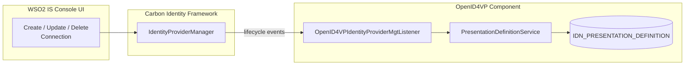
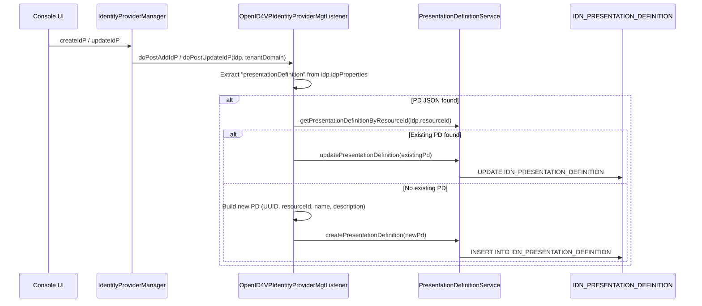
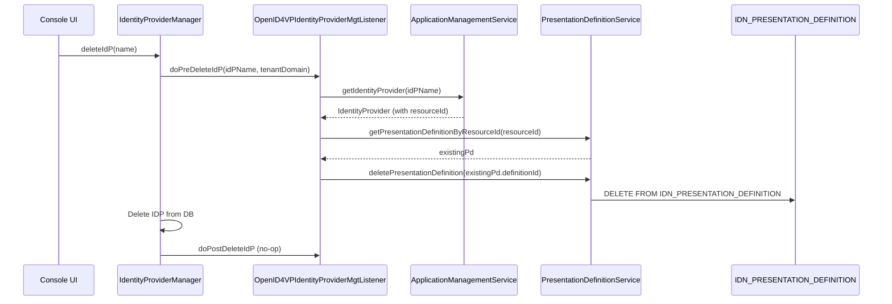

# Connection Management — Presentation Definition Lifecycle

## Overview

In WSO2 IS, an OpenID4VP verifier is configured as a **Connection** (internally an `IdentityProvider`). Each Connection has a **one-to-one relationship** with a `PresentationDefinition` that specifies what credentials the verifier requires from the wallet.

This relationship is managed automatically by the `OpenID4VPIdentityProviderMgtListener`, which hooks into the Connection lifecycle.

---

## Architecture



---

## The Listener: `OpenID4VPIdentityProviderMgtListener`

**File:** `listener/OpenID4VPIdentityProviderMgtListener.java`

This class extends `AbstractIdentityProviderMgtListener` (execution order: `99`) and intercepts four lifecycle events:

### Hook Methods

| Method | When Fired | Action |
|--------|-----------|--------|
| `doPostAddIdP` | After a new Connection is created | Creates a new `PresentationDefinition` if the `presentationDefinition` IDP property is set |
| `doPostUpdateIdP` | After a Connection is updated | Creates or updates the `PresentationDefinition` for the Connection's `resourceId` |
| `doPreDeleteIdP` | Before a Connection is deleted | Looks up the Connection by name, finds the associated PD by `resourceId`, and deletes it |
| `doPostDeleteIdP` | After a Connection is deleted | No-op (cleanup is handled in `doPreDeleteIdP` because the IDP is already gone from DB by this point) |

### Data Flow: Add / Update



### Data Flow: Delete



---

## Connection ↔ Presentation Definition Relationship

| Concept | Field | Storage |
|---------|-------|---------|
| Connection identity | `IdentityProvider.resourceId` | Carbon IDP tables |
| Link to PD | `PresentationDefinition.resourceId` | `IDN_PRESENTATION_DEFINITION.RESOURCE_ID` |
| PD content | `PresentationDefinition.definitionJson` | `IDN_PRESENTATION_DEFINITION.DEFINITION_JSON` (CLOB) |
| IDP property carrying PD | `idpProperties["presentationDefinition"]` | Transient — used by listener, not persisted as IDP property |

The `resourceId` is the foreign key that links a Connection to its Presentation Definition. This is a soft reference (no DB-level FK constraint) stored as a `VARCHAR(255)` with an index (`IDX_PRES_DEF_RESOURCE_ID`).

---

## Connection Configuration Properties

When an OpenID4VP Connection is created from the "Digital Credentials" template, the following authenticator properties are set:

| Property | Purpose | Example |
|----------|---------|---------|
| `didMethod` | DID method for verifier identity | `did:key`, `did:web`, `did:jwk` |
| `signingAlgorithm` | JWT signing algorithm | `EdDSA`, `ES256`, `RS256` |
| `presentationDefinition` | Full PD JSON (transient, consumed by listener) | `{"id":"...","input_descriptors":[...]}` |

These properties are read by `OpenID4VPAuthenticator.createVPRequest()` during authentication to configure the VP request parameters.

---

## OSGi Registration

The listener is registered as an OSGi service in `VPServiceRegistrationComponent.java`:

```java
bundleContext.registerService(IdentityProviderMgtListener.class.getName(),
        new OpenID4VPIdentityProviderMgtListener(), new Hashtable<>());
```

The listener depends on `ApplicationManagementService` (to look up IDPs by name during delete) and `PresentationDefinitionService` (to manage PD records), both accessed via `OpenID4VCPresentationDataHolder`.
