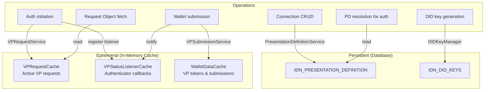

# Database & Cache — Storage Architecture

## Overview

The OpenID4VP component uses a **two-tier storage** strategy:

- **Database** — For persistent, long-lived data: Presentation Definitions and DID keys.
- **In-memory caches** — For ephemeral, request-scoped data: active VP requests, status listeners, and wallet submissions.

This split reflects the component's dual nature: Presentation Definitions and DID keys must survive restarts, while VP requests are inherently short-lived (seconds to minutes).

---

## 1. Database

### Schema

**File:** `src/main/resources/dbscripts/h2/openid4vp-h2.sql`

Schema is auto-initialized on component activation by `DatabaseSchemaInitializer.initializeSchema()`.

#### Table: `IDN_PRESENTATION_DEFINITION`

Stores the credential requirements that a verifier (Connection) presents to wallets.

| Column | Type | Description |
|--------|------|-------------|
| `DEFINITION_ID` | `VARCHAR(255)` PK | UUID, auto-generated |
| `RESOURCE_ID` | `VARCHAR(255)` | FK to Connection (indexed) |
| `NAME` | `VARCHAR(255)` | Human-readable name |
| `DESCRIPTION` | `CLOB` | Optional description |
| `DEFINITION_JSON` | `CLOB` | Full PD JSON (OpenID4VP §5.4) |
| `TENANT_ID` | `INTEGER` | Multi-tenancy support |

**Constraints:**
- Primary key on `DEFINITION_ID`
- Unique on `(NAME, TENANT_ID)` — names must be unique per tenant
- Index `IDX_PRES_DEF_RESOURCE_ID` on `RESOURCE_ID` — enables fast lookup by Connection

#### Logical Link: IDP to Presentation Definition

The link between a Connection (Identity Provider) and its Presentation Definition is maintained via the **Identity Provider Properties** (`IDP_AUTHENTICATOR_PROPERTY` table).

- **Property Key:** `presentationDefinition` (in `OpenID4VPAuthenticator` config)
- **Property Value:** The `DEFINITION_ID` (UUID) corresponding to a row in `IDN_PRESENTATION_DEFINITION`.

> **Note:** The UI sends the full JSON in this property during creation/update, but the `OpenID4VPIdentityProviderMgtListener` intercepts it, moves the JSON to the `IDN_PRESENTATION_DEFINITION` table, and replaces the property value with the UUID. This ensures the configuration remains lightweight while the definition data is structured properly.

#### Table: `IDN_DID_KEYS`

Persists cryptographic key pairs for DID identities (primarily Ed25519).

| Column | Type | Description |
|--------|------|-------------|
| `TENANT_ID` | `INTEGER` | Part of composite PK |
| `KEY_ID` | `VARCHAR(255)` | Key identifier, part of composite PK |
| `ALGORITHM` | `VARCHAR(50)` | e.g., `Ed25519` |
| `PUBLIC_KEY` | `BLOB` | Raw public key bytes |
| `PRIVATE_KEY` | `BLOB` | Raw private key bytes |
| `CREATED_AT` | `BIGINT` | Unix timestamp |

**Constraints:**
- Composite primary key on `(TENANT_ID, KEY_ID)`

---

### DAO Layer

Each table has a corresponding DAO interface + implementation:

| DAO | Table | Key Operations |
|-----|-------|----------------|
| `PresentationDefinitionDAO` | `IDN_PRESENTATION_DEFINITION` | CRUD + `getByResourceId` + `existsById` |
| `DIDKeysDAO` | `IDN_DID_KEYS` | `storeKeyPair`, `getKeyPair`, `deleteKeyPair` |
| `VPRequestDAO` | *(cache-backed)* | `create`, `getById`, `getByTransactionId`, `updateStatus` |
| `VPSubmissionDAO` | *(cache-backed)* | `create`, `getById`, `getByRequestId` |
| `TrustedIssuerDAO` | *(configuration)* | Trusted issuer management |

> **Note:** `VPRequestDAO` and `VPSubmissionDAO` exist as interfaces but are primarily backed by in-memory caches during the active auth flow. The DAO layer provides a database fallback abstraction, but the hot path is all in-memory.

---

## 2. In-Memory Caches

All three caches are **thread-safe singletons** using `ConcurrentHashMap` with TTL-based expiration driven by `ScheduledExecutorService`.

### 2.1. VPRequestCache

**File:** `cache/VPRequestCache.java`

**Purpose:** Stores active `VPRequest` objects during the authentication flow.

| Aspect | Detail |
|--------|--------|
| **Key** | `requestId` (String) |
| **Value** | `VPRequest` object |
| **Secondary index** | `transactionId` → `requestId` mapping |
| **Default TTL** | Configurable (typically 5 minutes) |
| **Cleanup** | `ScheduledExecutorService` runs periodic cleanup of expired entries |

**Operations:**
- `addRequest(VPRequest)` — stores with automatic TTL
- `getRequest(requestId)` / `getRequestByTransactionId(txnId)` — lookup
- `removeRequest(requestId)` — explicit removal
- `updateStatus(requestId, VPRequestStatus)` — status transition
- `getSize()` — current cache size

### 2.2. VPStatusListenerCache

**File:** `cache/VPStatusListenerCache.java`

**Purpose:** Manages push-notification listeners for VP request status changes. Enables the **callback pattern** where the authenticator receives submissions without polling the database.

| Aspect | Detail |
|--------|--------|
| **Key** | `requestId` (String) |
| **Value** | Map of `listenerId` → callback |
| **TTL** | Per-listener timeout (typically 30-60 seconds) |
| **Notification** | Synchronous callback on status change |

**Operations:**
- `registerListener(requestId, listenerId, callback)` — register with timeout
- `notifyListeners(requestId, submission)` — fire all callbacks for a request
- `removeListener(requestId, listenerId)` — unregister
- Internal cleanup of timed-out listeners

**Usage pattern:**
```
1. Authenticator registers itself as listener (initiateAuthenticationRequest)
2. Wallet submits VP token → VPSubmissionService calls notifyListeners
3. Callback fires → sets authenticator.receivedSubmission
4. Next poll detects status change → processAuthenticationResponse reads submission
```

### 2.3. WalletDataCache

**File:** `cache/WalletDataCache.java`

**Purpose:** Temporarily stores VP tokens, presentation submissions, and authentication contexts during active sessions.

| Aspect | Detail |
|--------|--------|
| **Storage** | 3 internal maps for tokens, submissions, and auth contexts |
| **Token key** | `state` or `requestId` |
| **Auth context key** | `sessionDataKey` |
| **Default TTL** | Configurable (typically 5 minutes) |
| **Cleanup** | Periodic flush of expired entries |

**Operations:**
- `storeToken(key, vpToken)` / `getToken(key)` / `hasToken(key)` — VP token management
- `storeSubmission(key, submissionJson)` / `getSubmission(key)` — presentation submission storage
- `storeAuthContext(sessionKey, context)` / `getAuthContext(sessionKey)` — authentication context

---

## 3. Data Flow Through Storage



### What Goes Where

| Data | Storage | Why |
|------|---------|-----|
| Presentation Definition JSON | Database (`IDN_PRESENTATION_DEFINITION`) | Must persist across restarts; referenced by multiple auth flows |
| DID key pairs | Database (`IDN_DID_KEYS`) | DID identity must be stable; same key = same DID |
| Active VP request | Cache (`VPRequestCache`) | Short-lived (minutes); high-frequency reads during polling |
| Status listeners | Cache (`VPStatusListenerCache`) | Callback references; inherently ephemeral |
| VP token + submission | Cache (`WalletDataCache`) | Needed only during active auth session; no long-term value |
| Authentication context | Cache (`WalletDataCache`) | Session-scoped; tied to browser session lifecycle |
