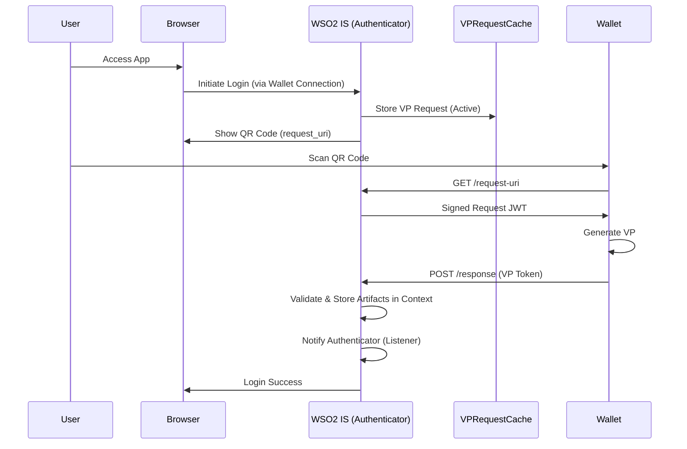

# OpenID4VP Wallet Connection Guide

This document explains how to configure the **OpenID4VP (Wallet)** authenticator in WSO2 Identity Server and provides a deep dive into its internal workflow.

## Part 1: Adding the Connection

### Prerequisites
-   WSO2 Identity Server 7.x installed and running.
-   The `identity-openid4vc` component installed.

### Step 1: Locate the Default Connection

> **Important**: The **Wallet (OpenID4VP)** authenticator is available by default in the **Connections** tab. You **do not** need to create a new connection.
>
> *Note: If you attempt to click "New Connection", the OpenID4VP authenticator will **not** appear in the list of available options. You must use the existing default connection.*

1.  **Log in to the Console**: Access the WSO2 Identity Server Console (e.g., `https://localhost:9443/console`).
2.  **Navigate to Connections**: Click on **Connections** in the side menu.
3.  **Find the Wallet Connection**: Look for a connection named **Standard Wallet**, **Wallet**, or similar in the list.

### Step 2: Configure the Authenticator

1.  **Go to Settings**: Click on the default Wallet connection and go to the **Settings** tab.
2.  **Federated Authenticators**: Scroll down to the **Federated Authenticators** section.
3.  **Select Wallet (OpenID4VP)**:
    -   Click on **Wallet (OpenID4VP)** to expand its settings.
    -   **Enable**: Ensure the **Enable** box is checked.

4.  **Configure Properties**:
    Fill in the required fields:

    | Property | Description | Default / Example |
    | :--- | :--- | :--- |
    | **Presentation Definition ID** | The unique ID of the Presentation Definition that specifies which credentials to request. If left empty, a default "Request Any Credential" definition is used. | `36f7b...` (UUID) |
    | **Response Mode** | How the wallet should send the response. `direct_post` sends the VP directly; `direct_post.jwt` sends a signed JWT. | `direct_post` |
    | **Timeout (seconds)** | How long the QR code/request remains valid. | `300` |
    | **Client ID** | The Client ID used in the VP Request. If empty, one is auto-generated. | `did:web:example.com` |
    | **Subject Claim** | The claim from the credential to use as the user's identifier (username). | `credentialSubject.id` |

5.  **Update**: Click **Update** to save any changes.

### Step 3: Add to Application

1.  **Navigate to Applications**: Go to **Applications** and select your application.
2.  **Login Flow**: Click on the **Login Flow** tab.
3.  **Add Sign-In Option**:
    -   Click the **+** (Add) button on the step where you want to add wallet authentication.
    -   Select the **Wallet** connection you located in Step 1.
    -   Click **Add**.
4.  **Update**: Click **Update** to save the changes.

---

## Part 2: Deep Dive - How It Works

The OpenID for Verifiable Presentations (OpenID4VP) authenticator follows a multi-step flow involving the User, the Identity Server, and the Digital Wallet.

### Technical Note: Connections Tab Visibility (Architecture)

The visibility of the OpenID4VP Authenticator in the **Connections** tab is driven by the Identity Server's architecture:

1.  **Interface Implementation**: The `OpenID4VPAuthenticator` class implements the `FederatedApplicationAuthenticator` interface.
2.  **OSGi Service Registration**: When the `identity-openid4vc` component starts, it registers this class as an OSGi service.
3.  **Framework Auto-Discovery**: The Identity Provider Management framework scans for all active OSGi services implementing `FederatedApplicationAuthenticator`.
    -   It automatically treats them as **System-Defined Identity Providers**.
    -   It exposes them as default "Connections" in the Console UI.
4.  **Why Default?**: This architectural pattern is used for authenticators that represent a standard protocol or a singleton service (like "Google", "Facebook", or in this case, "Standard Wallet"). It simplifies configuration by providing a ready-to-use instance rather than requiring administrators to manually create and configure a new Identity Provider from scratch.

### 1. Initiation (The QR Code)
1.  **User Action**: The user initiates login and selects the "Wallet" option.
2.  **Server Action (`OpenID4VPAuthenticator.initiateAuthenticationRequest`)**:
    -   Generates a unique `vp_request_id` and `state`.
    -   Creates a **VP Request** object containing the query (Presentation Definition).
    -   **Cache Storage**: Stores this request in the `VPRequestCache`. This is ephemeral data awaiting the wallet.
    -   **Listener Registration**: Registers itself as a listener in `VPStatusListenerCache`, waiting for a response correlated by the `request_id`.
    -   **UI Rendering**: Redirects the user's browser to a login page displaying a **QR Code**. This QR code contains a `request_uri` (a deep link) pointing back to the server.

### 2. Wallet Interaction (Scan & Fetch)
1.  **Scan**: The user scans the QR code with their Digital Wallet app.
2.  **Fetch Request**: The wallet makes an HTTP GET request to the `request_uri` embedded in the QR code.
3.  **Server Response**: The server looks up the request in the `VPRequestCache`.
    -   If valid, generating a **Signed Request Object (JWT)** on-the-fly (using its DID and private key).
    -   Returns the Request Object JWT to the wallet.

### 3. Submission (The Response)
1.  **Wallet Processing**: The wallet verifies the signature, prompts the user to select credentials matching the Presentation Definition, and generates a **Verifiable Presentation (VP)**.
2.  **Submission**: The wallet sends the VP to the `response_uri` (typically `/api/openid4vp/v1/response`) via an HTTP POST.
3.  **Server Processing (`VPResponseHandler` / `VPSubmissionServlet`)**:
    -   Validates the submission (signature, nonce, structure).
    -   **Notification**: Finds the registered listener (the Authenticator) in the `VPStatusListenerCache` and notifies it with the received `VPSubmission` object.

### 4. Completion (Authentication)
1.  **Authenticator Callback (`onSubmissionReceived` / Polling Check)**: The waiting `OpenID4VPAuthenticator` instance receives the submission.
2.  **Attribute Extraction**:
    -   Parses the VP Token (supporting `jwt_vp`, `ldp_vp`, `sd-jwt`).
    -   Extracts the **Subject Identifier** (e.g., email or ID) based on the `Subject Claim` configuration.
    -   Extracts other claims as user attributes.
3.  **Context Population (New!)**:
    -   Stores the **Raw VP Token** and **Presentation Submission** in the `AuthenticationContext`.
    -   Keys: `OPENID4VP_VP_TOKEN`, `OPENID4VP_PRESENTATION_SUBMISSION`.
    -   Sets the `AuthenticatedUser` in the context.
4.  **Finalization**: The Identity Server considers the step complete and proceeds to the next step or issues the final ID Token to the application.

### Architecture Diagram

