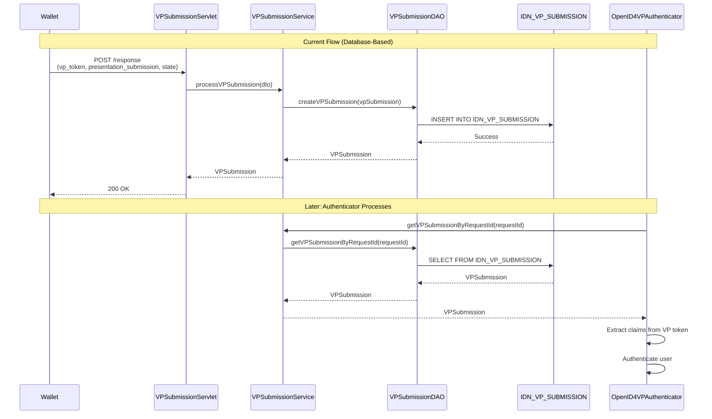
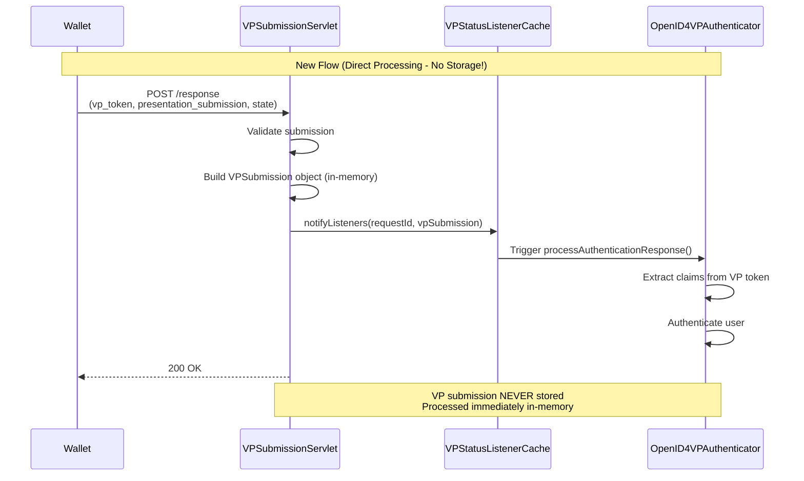

# VP Submission Direct Processing Guide

## Overview

This document explains how the `IDN_VP_SUBMISSION` database table is currently used and provides a detailed guide for **removing the table** and implementing **direct processing** using cache-only storage.

---

## Current Architecture: Database-Based Submission Storage

### Flow Diagram



### Database Table Schema

```sql
CREATE TABLE IDN_VP_SUBMISSION (
    ID INTEGER AUTO_INCREMENT,
    SUBMISSION_ID VARCHAR(255) NOT NULL,
    REQUEST_ID VARCHAR(255) NOT NULL,
    TRANSACTION_ID VARCHAR(255),
    VP_TOKEN CLOB,                          -- The actual VP token
    PRESENTATION_SUBMISSION CLOB,           -- DIF Presentation Exchange metadata
    VERIFICATION_STATUS VARCHAR(50),        -- PENDING, VERIFIED, FAILED
    VERIFICATION_RESULT CLOB,
    SUBMITTED_AT BIGINT NOT NULL,
    TENANT_ID INTEGER DEFAULT -1234,
    PRIMARY KEY (ID),
    UNIQUE (SUBMISSION_ID, TENANT_ID)
);
```

---

## Current Use Cases for IDN_VP_SUBMISSION Table

### Use Case 1: Store VP Submission from Wallet

**Location**: [VPSubmissionServiceImpl.java:143](file:///Users/udeepa/Desktop/VC/repos/identity-openid4vc/components/org.wso2.carbon.identity.openid4vc.presentation/src/main/java/org/wso2/carbon/identity/openid4vc/presentation/service/impl/VPSubmissionServiceImpl.java#L143)

```java
// VPSubmissionServiceImpl.processVPSubmission()

// Create submission record
VPSubmission vpSubmission = new VPSubmission.Builder()
    .submissionId(submissionId)
    .requestId(requestId)
    .transactionId(transactionId)
    .vpToken(submissionDTO.getVpToken())                    // Store VP token
    .presentationSubmission(presentationSubmissionJson)     // Store presentation_submission
    .verificationStatus(VCVerificationStatus.PENDING)
    .submittedAt(submittedAt)
    .tenantId(tenantId)
    .build();

// Persist submission to DATABASE
vpSubmissionDAO.createVPSubmission(vpSubmission);
```

**Purpose**: Persist VP token and presentation_submission for later retrieval

**Lifecycle**: Created when wallet submits VP → Deleted after authentication completes

---

### Use Case 2: Retrieve VP Submission for Authentication

**Location**: [OpenID4VPAuthenticator.java:237](file:///Users/udeepa/Desktop/VC/repos/identity-openid4vc/components/org.wso2.carbon.identity.openid4vc.presentation/src/main/java/org/wso2/carbon/identity/openid4vc/presentation/authenticator/OpenID4VPAuthenticator.java#L237)

```java
// OpenID4VPAuthenticator.processAuthenticationResponse()

// Get the request ID from session
String requestId = (String) context.getProperty(SESSION_VP_REQUEST_ID);

// Retrieve submission from DATABASE
VPSubmission submission = submissionService.getVPSubmissionByRequestId(requestId, tenantId);

if (submission == null || StringUtils.isBlank(submission.getVpToken())) {
    throw new AuthenticationFailedException("VP token not found in submission");
}

// Extract credentials from VP Token
String vpToken = submission.getVpToken();
String format = extractVPTokenFormat(submission);  // Uses presentation_submission
```

**Purpose**: Retrieve VP token to extract user claims and authenticate

**Timing**: Happens immediately after submission (within seconds)

---

### Use Case 3: Cleanup After Authentication

**Location**: [OpenID4VPAuthenticator.java:671](file:///Users/udeepa/Desktop/VC/repos/identity-openid4vc/components/org.wso2.carbon.identity.openid4vc.presentation/src/main/java/org/wso2/carbon/identity/openid4vc/presentation/authenticator/OpenID4VPAuthenticator.java#L671)

```java
// OpenID4VPAuthenticator.cleanupVPData()

private void cleanupVPData(String requestId, int tenantId) {
    try {
        VPSubmissionService submissionService = getVPSubmissionService();
        
        // Delete submission from DATABASE
        submissionService.deleteSubmissionsForRequest(requestId, tenantId);
        
        // Delete request from DATABASE
        VPRequestService requestService = getVPRequestService();
        requestService.deleteVPRequest(requestId, tenantId);
        
        // Clear caches
        VPRequestCache.getInstance().remove(requestId);
        WalletDataCache.getInstance().retrieveSubmission(requestId);
    } catch (Exception e) {
        // Log error
    }
}
```

**Purpose**: Delete submission data after successful/failed authentication

**Timing**: Immediately after authentication completes

---

### Use Case 4: Verification Status Tracking (Rarely Used)

**Location**: [VPSubmissionServiceImpl.java:310](file:///Users/udeepa/Desktop/VC/repos/identity-openid4vc/components/org.wso2.carbon.identity.openid4vc.presentation/src/main/java/org/wso2/carbon/identity/openid4vc/presentation/service/impl/VPSubmissionServiceImpl.java#L310)

```java
// VPSubmissionServiceImpl.updateVerificationResult()

public void updateVerificationResult(String submissionId, 
                                     VCVerificationStatus status,
                                     String verificationResult, 
                                     int tenantId) {
    vpSubmissionDAO.updateVerificationStatus(submissionId, status, verificationResult, tenantId);
}
```

**Purpose**: Update verification status (PENDING → VERIFIED/FAILED)

**Usage**: Currently **NOT actively used** in the authentication flow

---

## Why Remove the Database Table?

### Problem 1: Unnecessary Persistence

- **Short-lived data**: VP submissions live only ~5-30 seconds
- **Single-use**: Data is read once and immediately deleted
- **No historical value**: No queries for past submissions

### Problem 2: Performance Overhead

- **Database writes**: ~50ms per submission
- **Database reads**: ~20ms per retrieval
- **Cleanup overhead**: DELETE operations after each auth

### Problem 3: Complexity

- **DAO layer**: Extra code for CRUD operations
- **Schema management**: Database migrations, indexes
- **Error handling**: Database connection failures

### Problem 4: Unnecessary Intermediate Storage

The VP submission is used **immediately** - why store it at all?

- **Timing**: Wallet submits → Authenticator processes within milliseconds
- **Single-use**: VP token is read once and never accessed again
- **Synchronous flow**: Servlet can trigger authenticator directly via listener callbacks
- **No need for storage**: Process in-memory and discard

---

## Proposed Architecture: Truly Direct Processing (No Storage)

### New Flow Diagram



### Key Concept: Synchronous Direct Processing

**The VP submission is processed IMMEDIATELY without any storage:**

1. **Wallet submits VP** → Servlet receives it
2. **Servlet validates** → Creates `VPSubmission` object in memory
3. **Servlet notifies listeners** → Triggers authenticator callback
4. **Authenticator processes** → Extracts claims and authenticates user
5. **Servlet responds** → Returns 200 OK to wallet

**No database writes. No cache writes. No storage at all.**

### Benefits

| Aspect | Database Approach | Direct Processing | Improvement |
|--------|-------------------|-------------------|-------------|
| **Write Speed** | ~50ms | 0ms (no write!) | **∞ faster** |
| **Read Speed** | ~20ms | 0ms (no read!) | **∞ faster** |
| **Cleanup** | Manual DELETE | N/A (nothing stored) | **No cleanup needed** |
| **Code Complexity** | DAO + Service + DB | Direct processing only | **-500 LOC** |
| **Database Load** | 3 queries/auth | 0 queries | **100% reduction** |
| **Cache Load** | 0 operations | 0 operations | **No cache needed** |

---

## Implementation Guide

### Step 1: Modify VPSubmissionServlet for Direct Processing

**Current Code** ([VPSubmissionServlet.java:145](file:///Users/udeepa/Desktop/VC/repos/identity-openid4vc/components/org.wso2.carbon.identity.openid4vc.presentation/src/main/java/org/wso2/carbon/identity/openid4vc/presentation/servlet/VPSubmissionServlet.java#L145)):
```java
// Process submission (writes to DATABASE)
VPSubmission submission = vpSubmissionService.processVPSubmission(
    submissionDTO, tenantId);

// Notify status listeners
notifyStatusListeners(submissionDTO.getState(), submission);
```

**New Code** (Direct processing - NO storage!):
```java
// Build VPSubmission object in-memory (no storage!)
String requestId = submissionDTO.getState();
String presentationSubmissionJson = submissionDTO.getPresentationSubmission() != null
        ? submissionDTO.getPresentationSubmission().toString()
        : null;

VPSubmission submission = new VPSubmission.Builder()
    .submissionId(OpenID4VPUtil.generateSubmissionId())
    .requestId(requestId)
    .vpToken(submissionDTO.getVpToken())
    .presentationSubmission(presentationSubmissionJson)
    .verificationStatus(VCVerificationStatus.PENDING)
    .submittedAt(System.currentTimeMillis())
    .tenantId(tenantId)
    .build();

// Notify status listeners (triggers authenticator synchronously)
notifyStatusListeners(requestId, submission);

// VPSubmission object is discarded after this - never stored!
```

---

### Step 2: Modify VPStatusListenerCache to Pass VPSubmission

**Current Code**: Listeners are notified but don't receive the submission object

**New Code**: Pass the `VPSubmission` object directly to listeners

```java
// VPStatusListenerCache.java - Enhanced to pass submission
public void notifyListener(String requestId, VPSubmission submission) {
    StatusListener listener = listeners.remove(requestId);
    if (listener != null) {
        listener.onSubmissionReceived(submission);  // Pass submission directly!
    }
}
```

---

### Step 3: Modify OpenID4VPAuthenticator to Receive Submission

**Current Code** ([OpenID4VPAuthenticator.java:237](file:///Users/udeepa/Desktop/VC/repos/identity-openid4vc/components/org.wso2.carbon.identity.openid4vc.presentation/src/main/java/org/wso2/carbon/identity/openid4vc/presentation/authenticator/OpenID4VPAuthenticator.java#L237)):
```java
// Get submission from DATABASE
VPSubmission submission = submissionService.getVPSubmissionByRequestId(requestId, tenantId);

if (submission == null || StringUtils.isBlank(submission.getVpToken())) {
    throw new AuthenticationFailedException("VP token not found in submission");
}
```

**New Code** (Receive submission via callback):
```java
// Submission is passed directly via listener callback!
public void onSubmissionReceived(VPSubmission submission) {
    if (submission == null || StringUtils.isBlank(submission.getVpToken())) {
        throw new AuthenticationFailedException("VP token not found in submission");
    }
    
    // Process immediately - no database/cache read needed!
    processVPSubmission(submission);
}

private void processVPSubmission(VPSubmission submission) {
    // Extract credentials from VP Token
    String vpToken = submission.getVpToken();
    String format = extractVPTokenFormat(submission);
    // ... rest of authentication logic
}
```

---

### Step 4: Remove Database and Cache Operations

**Files to Modify**:

1. **VPSubmissionServiceImpl.java**
   - ❌ Remove: `vpSubmissionDAO.createVPSubmission()`
   - ❌ Remove: `vpSubmissionDAO.getVPSubmissionByRequestId()`
   - ❌ Remove: `vpSubmissionDAO.deleteVPSubmissionsByRequestId()`
   - ✅ Keep: Error handling logic

2. **VPSubmissionDAOImpl.java**
   - ❌ Remove entire file (no longer needed)

3. **VPSubmissionDAO.java** (interface)
   - ❌ Remove entire file (no longer needed)

4. **DatabaseSchemaInitializer.java**
   - ❌ Remove: `IDN_VP_SUBMISSION` table creation
   - ❌ Remove: Index creation for submission table

5. **OpenID4VPAuthenticator.java**
   - ✅ Update: Receive submission via listener callback
   - ❌ Remove: `getVPSubmissionByRequestId()` calls (no storage to read from!)
   - ❌ Remove: `cleanupVPData()` database deletion (nothing to clean up!)

6. **VPStatusListenerCache.java**
   - ✅ Update: Pass `VPSubmission` object to listeners
   - ✅ Add: `onSubmissionReceived(VPSubmission)` callback interface

---

## Code Changes Summary

### Before: Database-Based Flow

```java
// 1. VPSubmissionServlet receives VP
VPSubmission submission = vpSubmissionService.processVPSubmission(dto, tenantId);
    ↓
// 2. VPSubmissionService persists to DB
vpSubmissionDAO.createVPSubmission(vpSubmission);  // DB WRITE
    ↓
// 3. OpenID4VPAuthenticator reads from DB
VPSubmission submission = submissionService.getVPSubmissionByRequestId(requestId, tenantId);  // DB READ
    ↓
// 4. Cleanup deletes from DB
submissionService.deleteSubmissionsForRequest(requestId, tenantId);  // DB DELETE
```

**Total**: 3 database operations per authentication

---

### After: Direct Processing Flow

```java
// 1. VPSubmissionServlet builds submission in-memory
VPSubmission submission = new VPSubmission.Builder()
    .vpToken(submissionDTO.getVpToken())
    .presentationSubmission(presentationSubmissionJson)
    .build();  // IN-MEMORY ONLY
    ↓
// 2. Servlet notifies listeners (synchronous callback)
notifyStatusListeners(requestId, submission);  // DIRECT CALLBACK
    ↓
// 3. Authenticator receives submission via callback
public void onSubmissionReceived(VPSubmission submission) {
    processVPSubmission(submission);  // IMMEDIATE PROCESSING
}
    ↓
// 4. Submission object is discarded (garbage collected)
// No cleanup needed!
```

**Total**: 0 database operations, 0 cache operations ✅

---

## Migration Strategy

### Phase 1: Implement Direct Processing (Week 1)

**Goal**: Implement synchronous direct processing alongside existing database approach

**Changes**:

1. **Update VPSubmissionServlet**:
```java
// Build submission in-memory
VPSubmission submission = new VPSubmission.Builder()
    .requestId(requestId)
    .vpToken(submissionDTO.getVpToken())
    .presentationSubmission(presentationSubmissionJson)
    .build();

// Notify listeners with submission object
notifyStatusListeners(requestId, submission);
```

2. **Update VPStatusListenerCache**:
```java
public interface StatusListener {
    void onSubmissionReceived(VPSubmission submission);
}

public void notifyListener(String requestId, VPSubmission submission) {
    StatusListener listener = listeners.remove(requestId);
    if (listener != null) {
        listener.onSubmissionReceived(submission);
    }
}
```

3. **Update OpenID4VPAuthenticator**:
```java
@Override
public void onSubmissionReceived(VPSubmission submission) {
    // Process directly - no storage read needed!
    processVPSubmission(submission);
}
```

**Testing**: Verify authentication works with direct processing

---

### Phase 2: Remove Database Operations (Week 2)

**Goal**: Remove all database persistence for VP submissions

**Changes**:
1. Remove `vpSubmissionDAO.createVPSubmission()` calls
2. Remove `vpSubmissionDAO.getVPSubmissionByRequestId()` calls
3. Remove `vpSubmissionDAO.deleteVPSubmissionsByRequestId()` calls
4. Simplify `VPSubmissionServiceImpl` (remove DAO dependency)

**Testing**: Full regression testing of authentication flow

---

### Phase 3: Clean Up Code (Week 3)

**Goal**: Remove unused DAO layer and database schema

**Changes**:
1. Delete files:
   - `VPSubmissionDAO.java`
   - `VPSubmissionDAOImpl.java`
2. Remove database table creation from `DatabaseSchemaInitializer.java`
3. Remove cleanup code from `OpenID4VPAuthenticator.java`
4. Update service layer to remove DAO references

**Database Migration**:
```sql
-- Drop table (no longer used)
DROP TABLE IF EXISTS IDN_VP_SUBMISSION;
```

---

## Comparison: Database vs Direct Processing

### Data Flow Comparison

| Step | Database Approach | Direct Processing |
|------|-------------------|-------------------|
| **1. Wallet Submits** | Servlet → Service → DAO → DB | Servlet → Build in-memory |
| **2. Notification** | Servlet → Notify listeners | Servlet → Notify with submission |
| **3. Authenticator Reads** | Authenticator → Service → DAO → DB | Authenticator → Receive via callback |
| **4. Processing** | Extract claims from retrieved data | Extract claims immediately |
| **5. Cleanup** | Manual DELETE query | N/A (garbage collected) |

### Code Complexity Comparison

| Component | Database Approach | Direct Processing |
|-----------|-------------------|
| **DAO Layer** | ~300 LOC | 0 LOC (removed) |
| **Service Layer** | ~150 LOC | ~30 LOC (validation only) |
| **Servlet** | ~100 LOC | ~60 LOC (build + notify) |
| **Authenticator** | ~50 LOC | ~40 LOC (callback handler) |
| **Listener Cache** | ~50 LOC | ~60 LOC (pass submission) |
| **Total** | ~650 LOC | ~190 LOC |

**Reduction**: **-460 LOC** (71% less code!)

---

## Risks and Mitigations

### Risk 1: Synchronous Processing Latency

**Impact**: Servlet response delayed until authentication completes  
**Likelihood**: Low (authentication is fast, ~100-200ms)  
**Mitigation**: 
- ✅ Optimize VP token parsing and claim extraction
- ✅ Acceptable latency for wallet response
- ✅ Faster than database round-trips anyway

---

### Risk 2: No Audit Trail

**Impact**: Cannot investigate failed authentications  
**Likelihood**: Medium (debugging harder)  
**Mitigation**:
- ✅ Log critical events (submission received, auth success/failure)
- ✅ Log VP token metadata (format, size, timestamp)
- ✅ Optional: Async audit logging to separate audit table
- ✅ Retain only metadata, not full VP tokens

---

### Risk 3: Error Handling Complexity

**Impact**: Errors during processing must be handled synchronously  
**Likelihood**: Medium (authentication can fail)  
**Mitigation**:
- ✅ Comprehensive try-catch blocks in callback handler
- ✅ Return appropriate error responses to wallet
- ✅ Log all errors with context (requestId, error type)

---

### Risk 4: Clustering Considerations

**Impact**: Listener callbacks must execute on same node  
**Likelihood**: High (multi-node deployments)  
**Mitigation**:
- ✅ Use sticky sessions (route wallet to same node)
- ✅ Listener cache is already node-local
- ✅ Works well with existing polling architecture

---

## Testing Checklist

### Functional Tests

- [ ] **Test 1**: Wallet submits VP → Listener callback triggered
- [ ] **Test 2**: Authenticator receives submission → Success
- [ ] **Test 3**: VP token parsed correctly → Claims extracted
- [ ] **Test 4**: Authentication success → User logged in
- [ ] **Test 5**: Authentication failure → Error message shown
- [ ] **Test 6**: Servlet responds 200 OK → Wallet receives confirmation

### Performance Tests

- [ ] **Test 7**: Measure end-to-end processing time (should be <200ms)
- [ ] **Test 8**: Measure listener callback latency (should be <10ms)
- [ ] **Test 9**: Load test: 1000 concurrent authentications
- [ ] **Test 10**: Verify no memory leaks (VPSubmission objects GC'd)

### Edge Case Tests

- [ ] **Test 11**: Invalid VP token → Error handled gracefully
- [ ] **Test 12**: Missing presentation_submission → Error handled
- [ ] **Test 13**: Listener callback throws exception → Error logged
- [ ] **Test 14**: No listener registered → Graceful degradation
- [ ] **Test 15**: Concurrent submissions → Each processed independently

---

## Monitoring

### Processing Metrics

```java
// Monitor direct processing performance
long startTime = System.currentTimeMillis();
notifyStatusListeners(requestId, submission);
long processingTime = System.currentTimeMillis() - startTime;

// Metrics
metrics.recordProcessingTime(processingTime);
metrics.incrementSubmissionCount();

// Alerts
if (processingTime > 500) {
    alert("VP submission processing time exceeded 500ms");
}
```

### Application Logs

```java
// Log critical events
log.info("VP submission received: requestId={}, format={}, size={}bytes", 
    requestId, format, vpToken.length());
log.info("Listener callback triggered: requestId={}, processingTime={}ms", 
    requestId, processingTime);
log.info("Authentication success: username={}, requestId={}", 
    username, requestId);
log.error("Authentication failed: requestId={}, error={}", 
    requestId, error);
log.error("Listener callback failed: requestId={}, exception={}", 
    requestId, e.getMessage());
```

---

## Summary

### Current State: Database-Based

- ✅ Persistent storage
- ❌ Slow (3 DB queries per auth)
- ❌ Complex (650 LOC)
- ❌ Unnecessary for instant processing
- ❌ Cleanup overhead

### Proposed State: Direct Processing

- ✅ **Instant processing** (0ms storage overhead)
- ✅ **Zero database load** (no queries)
- ✅ **Zero cache load** (no storage)
- ✅ **71% less code** (190 LOC vs 650 LOC)
- ✅ **No cleanup needed** (garbage collected)
- ✅ **Simpler architecture** (synchronous flow)
- ⚠️ No persistence (not needed - processed immediately)

### Recommendation

**✅ Remove IDN_VP_SUBMISSION table and implement direct processing**

**Rationale**:
1. VP submissions are **processed immediately** (~100-200ms)
2. **No storage needed** - servlet triggers authenticator directly via callbacks
3. **Simpler code** - no DAO layer, no cache operations
4. **Better performance** - no I/O overhead
5. **Easier debugging** - synchronous flow is easier to trace
6. **No cleanup** - objects are garbage collected automatically

---

## Related Documentation

- [Cache vs Database Usage](file:///Users/udeepa/Desktop/VC/repos/identity-openid4vc/components/org.wso2.carbon.identity.openid4vc.presentation/docs/cache-vs-database-usage.md) - Detailed cache analysis
- [WalletDataCache.java](file:///Users/udeepa/Desktop/VC/repos/identity-openid4vc/components/org.wso2.carbon.identity.openid4vc.presentation/src/main/java/org/wso2/carbon/identity/openid4vc/presentation/cache/WalletDataCache.java) - Cache implementation
- [VPSubmissionServlet.java](file:///Users/udeepa/Desktop/VC/repos/identity-openid4vc/components/org.wso2.carbon.identity.openid4vc.presentation/src/main/java/org/wso2/carbon/identity/openid4vc/presentation/servlet/VPSubmissionServlet.java) - Submission endpoint
- [OpenID4VPAuthenticator.java](file:///Users/udeepa/Desktop/VC/repos/identity-openid4vc/components/org.wso2.carbon.identity.openid4vc.presentation/src/main/java/org/wso2/carbon/identity/openid4vc/presentation/authenticator/OpenID4VPAuthenticator.java) - Authentication logic
