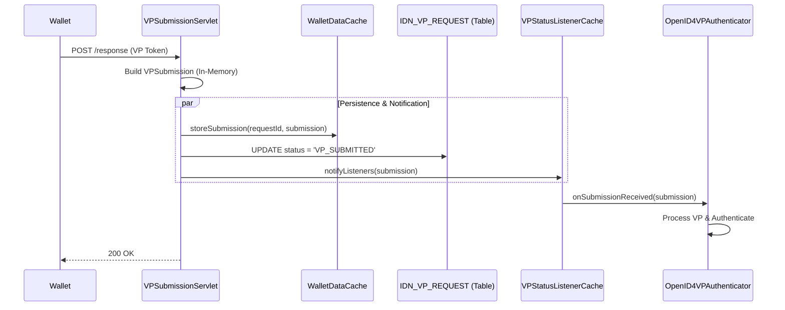
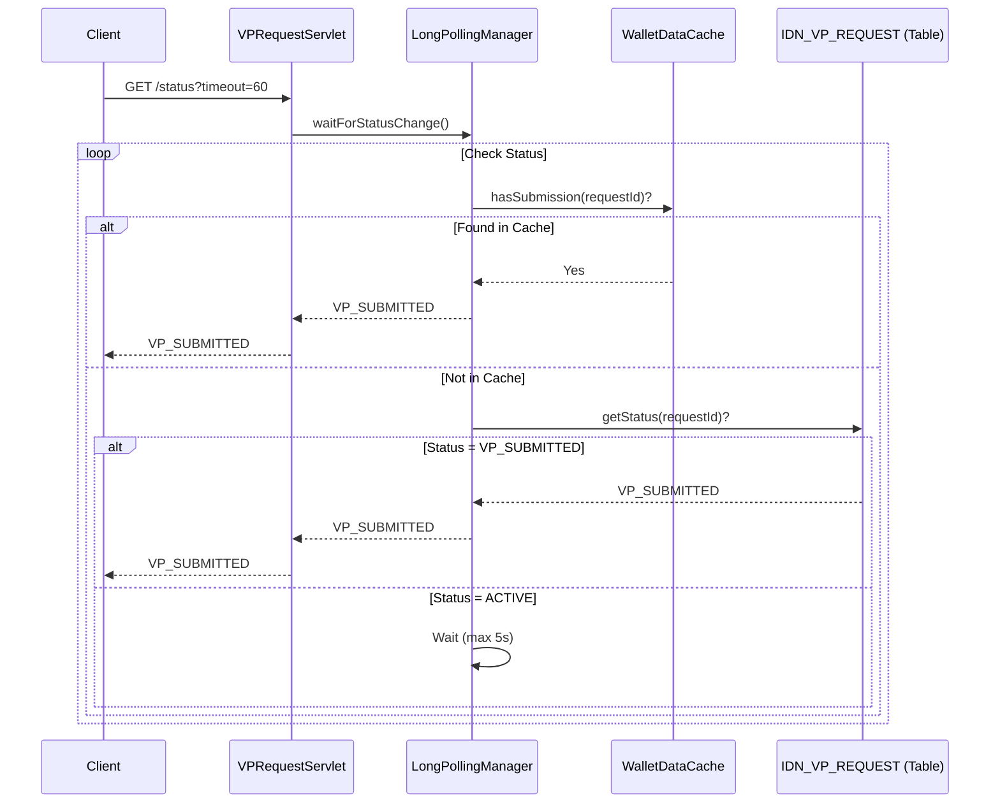

# VP Submission & Polling: Complete Flow Guide

This document explains the end-to-end flow of Verifiable Presentation (VP) submission, direct processing, and status polling as currently implemented.

## Overview

The system processes VP submissions **directly in memory** for performance, bypassing database storage for the VP token itself. However, it updates the request **status** in the database to ensure consistency for status polling.

---

## 1. VP Submission Flow

When a Wallet submits a VP to the `/response` endpoint:

1.  **Request Reception**:
    *   `VPSubmissionServlet` receives the POST request.
    *   Extracts `vp_token` and `presentation_submission`.

2.  **In-Memory Object Creation**:
    *   A `VPSubmission` object is built in memory.
    *   **NO** database entry is created for the submission itself (the `IDN_VP_SUBMISSION` table is unused/removed).

3.  **Cache Storage (For Polling)**:
    *   The submission is stored in `WalletDataCache`.
    *   **Purpose**: Allows the status polling endpoint to detect the submission immediately without a database round-trip.

4.  **Database Status Update**:
    *   Updates `IDN_VP_REQUEST` table status to `VP_SUBMITTED`.
    *   **Purpose**: Provides persistence for the request status and serves as a fallback for polling.

5.  **Direct Notification**:
    *   Calls `VPStatusListenerCache.notifyListeners()`.
    *   Passes the `VPSubmission` object directly to waiting listeners.
    *   **Result**: The `OpenID4VPAuthenticator` receives the submission synchronously via callback and proceeds with authentication.

### Diagram

---

## 2. Status Polling Flow

When the Client (Browser) polls `/vp-request/{id}/status`:

1.  **Request Reception**:
    *   `VPRequestServlet` receives the GET request.

2.  **Long Polling Manager**:
    *   Delegates to `LongPollingManager.waitForStatusChange()`.

3.  **Status Check (Priority Order)**:
    *   **Step 1: Cache Check**: Checks `WalletDataCache`. If submission exists → Returns `VP_SUBMITTED`.
    *   **Step 2: Database Check**: Checks `IDN_VP_REQUEST` table. If status is `VP_SUBMITTED` → Returns `VP_SUBMITTED`.

4.  **Wait (Long Poll)**:
    *   If status is pending, it waits on a `CountDownLatch`.
    *   **Timeout**: 5 seconds (Reduced from 60s).
    *   **Trigger**: If a submission arrives during the wait, the `VPStatusListenerCache` triggers the latch release.

### Diagram

---

## 3. Tables & Caches Referenced

### Database Tables

| Table Name | Usage | Description |
|------------|-------|-------------|
| **`IDN_VP_REQUEST`** | **Active** | Stores the VP Request metadata (ID, expiry, etc.) and current Status. Updated to `VP_SUBMITTED` upon submission. |
| ~~`IDN_VP_SUBMISSION`~~ | **Removed** | Previously used to store the full VP token. Now **NOT USED**; submission data is transient in memory. |

### Caches

| Cache Name | Usage | Description |
|------------|-------|-------------|
| **`WalletDataCache`** | **Active** | Temporarily stores the `VPSubmission` object. Primary source for status polling checks. |
| **`VPStatusListenerCache`** | **Active** | Manages active listeners (CountDownLatches) for long polling and handles direct notification of new submissions. |

---

## Summary of Improvements

*   **Direct Processing**: No database writes for the heavy VP token data.
*   **Faster Polling**: Cache-first checks eliminate database reads for the happy path.
*   **Reduced Retention**: VP data is held only in memory/cache and discarded after processing/timeout.
*   **Reliability**: Database status update ensures enabling persistence of the final state, even if cache is evicted.
