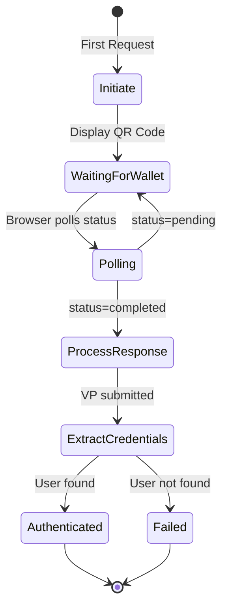

# OpenID4VP Authenticator Package

## Package: `org.wso2.carbon.identity.openid4vc.presentation.authenticator`

This package contains the authentication framework integration components that enable OpenID4VP as a local authenticator in WSO2 Identity Server.

---

## Files

### 1. OpenID4VPAuthenticator.java

**Location:** [OpenID4VPAuthenticator.java](file:///Users/udeepa/Desktop/VC/repos/identity-openid4vc/components/org.wso2.carbon.identity.openid4vc.presentation/src/main/java/org/wso2/carbon/identity/openid4vc/presentation/authenticator/OpenID4VPAuthenticator.java)

**Purpose:** Primary authenticator implementation that integrates OpenID4VP into WSO2 IS authentication framework.

**Implements:** `LocalApplicationAuthenticator`

#### Key Methods

| Method | Description |
|--------|-------------|
| `getName()` | Returns `"OpenID4VPAuthenticator"` |
| `getFriendlyName()` | Returns `"OpenID4VP Wallet Login"` |
| `initiateAuthenticationRequest()` | Creates VP request, generates QR code, redirects to wallet login page |
| `processAuthenticationResponse()` | Extracts user credentials from VP token, authenticates user |
| `process()` | Main entry point - routes to initiate or poll handlers |
| `handlePollRequest()` | Handles AJAX polling from login page |
| `handleStatusCallback()` | Handles status updates from frontend |
| `createVPRequest()` | Creates a new VP request session with nonce/state |
| `resolvePresentationDefinitionId()` | Resolves which presentation definition to use |

#### Authentication Flow



#### VP Token Parsing Logic

The authenticator handles multiple VP token formats:

1. **JSON-LD Format** - Token starts with `{` or `[`
2. **SD-JWT Format** - Token contains `~` separator
3. **Standard JWT** - 3 dot-separated parts
4. **Multi-part JWT** - More than 3 parts (extracts first JWT)

```java
// Parsing priority:
if (trimmedToken.startsWith("{")) {
    // Parse as JSON-LD
} else if (vpToken.contains("~")) {
    // Parse as SD-JWT - extract issuer JWT
} else if (dotParts.length == 3) {
    // Parse as standard JWT
} else if (dotParts.length > 3) {
    // Extract first JWT segment
}
```

#### Credential Extraction

Extracts user identity from `credentialSubject`:

| Field Priority | Claim Name |
|---------------|------------|
| 1 (highest) | `email` |
| 2 | `username` |
| 3 | `id` |
| 4 | `sub` |
| 5 | `name` |
| 6 (lowest) | `holder` |

#### Configuration Properties

| Property | Description | Default |
|----------|-------------|---------|
| `PROP_PRESENTATION_DEFINITION_ID` | Presentation definition to use | (none) |

---

### 2. WalletAuthenticator.java

**Location:** [WalletAuthenticator.java](file:///Users/udeepa/Desktop/VC/repos/identity-openid4vc/components/org.wso2.carbon.identity.openid4vc.presentation/src/main/java/org/wso2/carbon/identity/openid4vc/presentation/authenticator/WalletAuthenticator.java)

**Purpose:** Alternative authenticator for mobile wallet deep-link flows (non-QR code).

**Implements:** `LocalApplicationAuthenticator`

#### Key Differences from OpenID4VPAuthenticator

| Aspect | OpenID4VPAuthenticator | WalletAuthenticator |
|--------|------------------------|---------------------|
| Entry | QR code scan | Deep link / App invoke |
| UI | Login page with QR | Redirect to wallet app |
| Polling | AJAX polling | Callback-based |

---

## Integration Points

### OSGi Registration

Registered in `VPServiceRegistrationComponent`:

```java
OpenID4VPAuthenticator authenticator = new OpenID4VPAuthenticator();
bundleContext.registerService(
    ApplicationAuthenticator.class.getName(),
    authenticator, 
    new Hashtable<>()
);
```

### Authentication Framework

The authenticator integrates with WSO2 IS authentication framework:

```
Authentication Request
    └── AuthenticationContext
        └── OpenID4VPAuthenticator.process()
            ├── initiateAuthenticationRequest() → Display QR
            └── processAuthenticationResponse() → Authenticate user
```

---

## Usage

### Enabling the Authenticator

1. Add to application authentication sequence in IS Console
2. Configure presentation definition (optional)

### Custom Presentation Definition

```json
{
  "presentationDefinitionId": "employee_verification"
}
```

### Passwordless Authentication

When a valid VP is submitted from a wallet:
1. Email/username extracted from `credentialSubject`
2. User looked up in IS user store
3. If user exists → authenticated without password
4. VP signature serves as proof of identity
