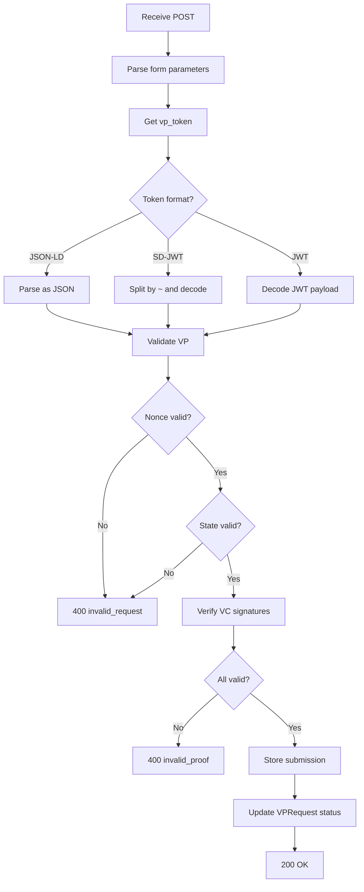

# OpenID4VP Servlet Package

## Package: `org.wso2.carbon.identity.openid4vc.presentation.servlet`

This package contains all HTTP servlets that expose OpenID4VP REST API endpoints.

---

## Servlet Overview

| Servlet | Path | Methods | Purpose |
|---------|------|---------|---------|
| VPRequestServlet | `/openid4vp/v1/request` | POST | Create VP request |
| RequestUriServlet | `/openid4vp/v1/request-uri/{id}` | GET | Wallet fetches request |
| VPSubmissionServlet | `/openid4vp/v1/response` | POST | Wallet submits VP |
| VPStatusPollingServlet | `/openid4vp/v1/status/{id}` | GET | Poll for completion |
| VPResultServlet | `/openid4vp/v1/result/{id}` | GET | Get verification result |
| VPDefinitionServlet | `/openid4vp/v1/presentation-definitions` | CRUD | Manage definitions |
| VCVerificationServlet | `/openid4vp/v1/verify` | POST | Standalone VC verify |
| WellKnownDIDServlet | `/.well-known/did.json` | GET | Verifier DID doc |

---

## Detailed File Documentation

### 1. VPSubmissionServlet.java

**Location:** [VPSubmissionServlet.java](file:///Users/udeepa/Desktop/VC/repos/identity-openid4vc/components/org.wso2.carbon.identity.openid4vc.presentation/src/main/java/org/wso2/carbon/identity/openid4vc/presentation/servlet/VPSubmissionServlet.java)

**Path:** `POST /openid4vp/v1/response`

**Purpose:** Receives VP submissions from wallets (direct_post response mode).

#### Request Format

```
Content-Type: application/x-www-form-urlencoded

vp_token=<jwt_or_json>&presentation_submission=<json>&state=<state>
```

#### Processing Flow



#### Key Methods

| Method | Description |
|--------|-------------|
| `doPost()` | Main entry point for wallet submissions |
| `parseVPToken()` | Handles JWT/SD-JWT/JSON-LD formats |
| `validateSubmission()` | Validates nonce, state, expiry |
| `verifyCredentials()` | Calls VCVerificationService |

---

### 2. VPRequestServlet.java

**Location:** [VPRequestServlet.java](file:///Users/udeepa/Desktop/VC/repos/identity-openid4vc/components/org.wso2.carbon.identity.openid4vc.presentation/src/main/java/org/wso2/carbon/identity/openid4vc/presentation/servlet/VPRequestServlet.java)

**Path:** `POST /openid4vp/v1/request`

**Purpose:** Creates new VP authorization requests.

#### Request Body

```json
{
  "presentationDefinitionId": "employee_verification",
  "callbackUrl": "https://app.example.com/callback",
  "clientId": "did:web:verifier.example.com"
}
```

#### Response

```json
{
  "requestId": "req_abc123",
  "requestUri": "https://is.example.com/openid4vp/v1/request-uri/req_abc123",
  "qrCodeData": "openid4vp://authorize?request_uri=...",
  "expiresAt": "2025-01-20T10:30:00Z"
}
```

---

### 3. RequestUriServlet.java

**Location:** [RequestUriServlet.java](file:///Users/udeepa/Desktop/VC/repos/identity-openid4vc/components/org.wso2.carbon.identity.openid4vc.presentation/src/main/java/org/wso2/carbon/identity/openid4vc/presentation/servlet/RequestUriServlet.java)

**Path:** `GET /openid4vp/v1/request-uri/{id}`

**Purpose:** Wallet fetches the full authorization request object.

#### Response (JWT or JSON)

```json
{
  "response_type": "vp_token",
  "client_id": "did:web:verifier.example.com",
  "response_uri": "https://is.example.com/openid4vp/v1/response",
  "response_mode": "direct_post",
  "nonce": "n-0S6_WzA2Mj",
  "state": "af0ifjsldkj",
  "presentation_definition": { ... }
}
```

---

### 4. VPStatusPollingServlet.java

**Location:** [VPStatusPollingServlet.java](file:///Users/udeepa/Desktop/VC/repos/identity-openid4vc/components/org.wso2.carbon.identity.openid4vc.presentation/src/main/java/org/wso2/carbon/identity/openid4vc/presentation/servlet/VPStatusPollingServlet.java)

**Path:** `GET /openid4vp/v1/status/{id}`

**Purpose:** Browser/client polls for VP submission completion.

#### Response

```json
{
  "status": "pending|completed|failed|expired",
  "error": null,
  "submissionId": "sub_xyz789"
}
```

#### Polling States

| Status | Description |
|--------|-------------|
| `pending` | Waiting for wallet |
| `completed` | VP submitted and verified |
| `failed` | Verification failed |
| `expired` | Request timed out |

---

### 5. VPDefinitionServlet.java

**Location:** [VPDefinitionServlet.java](file:///Users/udeepa/Desktop/VC/repos/identity-openid4vc/components/org.wso2.carbon.identity.openid4vc.presentation/src/main/java/org/wso2/carbon/identity/openid4vc/presentation/servlet/VPDefinitionServlet.java)

**Path:** `/openid4vp/v1/presentation-definitions`

**Purpose:** CRUD operations for presentation definitions.

#### Endpoints

| Method | Path | Description |
|--------|------|-------------|
| GET | `/presentation-definitions` | List all |
| GET | `/presentation-definitions/{id}` | Get one |
| POST | `/presentation-definitions` | Create |
| PUT | `/presentation-definitions/{id}` | Update |
| DELETE | `/presentation-definitions/{id}` | Delete |

---

### 6. VCVerificationServlet.java

**Location:** [VCVerificationServlet.java](file:///Users/udeepa/Desktop/VC/repos/identity-openid4vc/components/org.wso2.carbon.identity.openid4vc.presentation/src/main/java/org/wso2/carbon/identity/openid4vc/presentation/servlet/VCVerificationServlet.java)

**Path:** `POST /openid4vp/v1/verify`

**Purpose:** Standalone VC verification (not part of VP flow).

#### Request

```json
{
  "credential": "<jwt_vc>",
  "checkRevocation": true
}
```

#### Response

```json
{
  "valid": true,
  "issuer": "did:web:issuer.example.com",
  "claims": { ... },
  "revoked": false
}
```

---

### 7. WellKnownDIDServlet.java

**Location:** [WellKnownDIDServlet.java](file:///Users/udeepa/Desktop/VC/repos/identity-openid4vc/components/org.wso2.carbon.identity.openid4vc.presentation/src/main/java/org/wso2/carbon/identity/openid4vc/presentation/servlet/WellKnownDIDServlet.java)

**Path:** `GET /.well-known/did.json`

**Purpose:** Serves the verifier's DID document for `did:web` resolution.

#### Response

```json
{
  "@context": ["https://www.w3.org/ns/did/v1"],
  "id": "did:web:is.example.com",
  "verificationMethod": [{
    "id": "did:web:is.example.com#key-1",
    "type": "Ed25519VerificationKey2020",
    "controller": "did:web:is.example.com",
    "publicKeyMultibase": "z6Mk..."
  }],
  "authentication": ["did:web:is.example.com#key-1"]
}
```

---

## Servlet Registration

Servlets are registered in `VPServletRegistrationComponent`:

```java
@Component
public class VPServletRegistrationComponent {
    @Activate
    protected void activate(ComponentContext context) {
        ServletRegistration.Dynamic vpSubmission = servletContext
            .addServlet("VPSubmissionServlet", new VPSubmissionServlet());
        vpSubmission.addMapping("/openid4vp/v1/response");
        // ... other servlets
    }
}
```

---

## Common Response Patterns

### Success Response

```json
{
  "status": "success",
  "data": { ... }
}
```

### Error Response

```json
{
  "error": "invalid_request",
  "error_description": "Missing required parameter: vp_token"
}
```

### CORS Headers

All servlets add CORS headers via `CORSUtil`:

```
Access-Control-Allow-Origin: *
Access-Control-Allow-Methods: GET, POST, OPTIONS
Access-Control-Allow-Headers: Content-Type, Authorization
```
