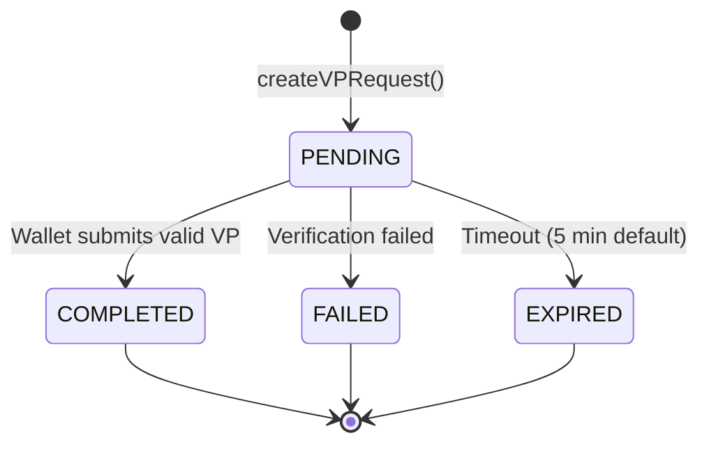
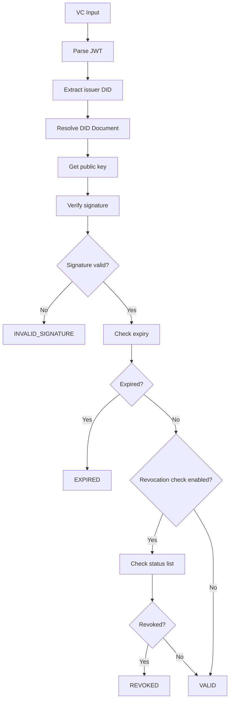
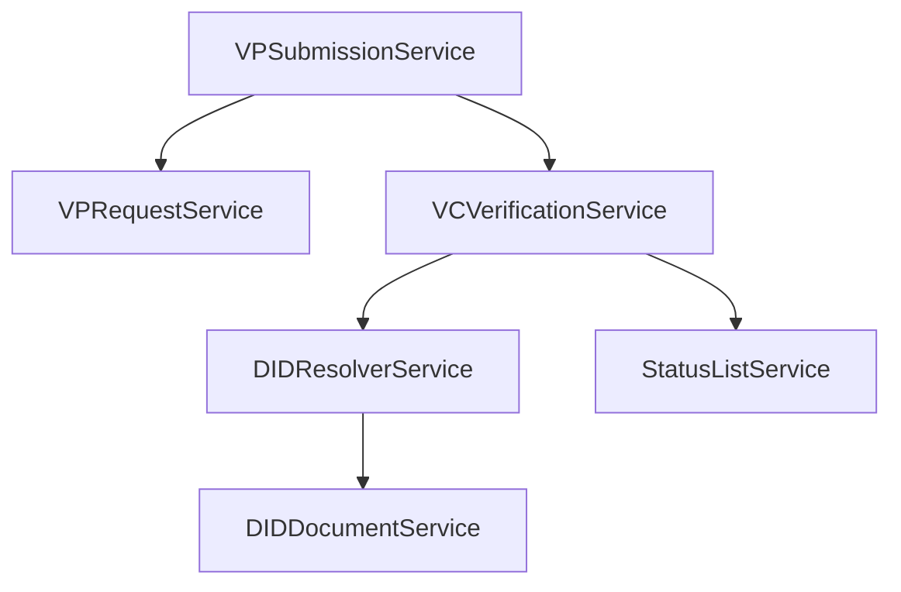

# OpenID4VP Service Package

## Package: `org.wso2.carbon.identity.openid4vc.presentation.service`

This package contains service interfaces and their implementations that encapsulate all business logic.

---

## Service Overview

| Service | Purpose |
|---------|---------|
| VPRequestService | VP request lifecycle management |
| VPSubmissionService | Handle wallet submissions |
| VPResultService | Get verification results |
| VCVerificationService | Verify VC signatures and claims |
| PresentationDefinitionService | CRUD for definitions |
| DIDDocumentService | Generate verifier DID documents |
| DIDResolverService | Resolve external DIDs |
| StatusListService | Check VC revocation |
| TrustedIssuerService | Manage trusted issuers |
| TrustedVerifierService | Manage trusted verifiers |
| ApplicationPresentationDefinitionMappingService | Link apps to definitions |

---

## Detailed Service Documentation

### 1. VPRequestService

**Interface:** [VPRequestService.java](file:///Users/udeepa/Desktop/VC/repos/identity-openid4vc/components/org.wso2.carbon.identity.openid4vc.presentation/src/main/java/org/wso2/carbon/identity/openid4vc/presentation/service/VPRequestService.java)

**Implementation:** `VPRequestServiceImpl.java`

#### Methods

| Method | Description |
|--------|-------------|
| `createVPRequest(dto)` | Creates new VP request with nonce/state |
| `getVPRequest(id)` | Retrieves request by ID |
| `updateStatus(id, status)` | Updates request status |
| `deleteVPRequest(id)` | Removes request |
| `getAuthorizationRequest(id)` | Generates signed JWT request object |

#### VPRequest Lifecycle



---

### 2. VPSubmissionService

**Interface:** [VPSubmissionService.java](file:///Users/udeepa/Desktop/VC/repos/identity-openid4vc/components/org.wso2.carbon.identity.openid4vc.presentation/src/main/java/org/wso2/carbon/identity/openid4vc/presentation/service/VPSubmissionService.java)

**Implementation:** `VPSubmissionServiceImpl.java`

#### Methods

| Method | Description |
|--------|-------------|
| `processSubmission(dto)` | Validates and stores VP submission |
| `getSubmission(id)` | Retrieves submission |
| `getSubmissionByRequestId(reqId)` | Gets submission for a request |

#### Submission Processing

```java
public VPSubmission processSubmission(VPSubmissionDTO dto) {
    // 1. Validate request exists and not expired
    VPRequest request = vpRequestService.getVPRequest(dto.getState());
    
    // 2. Parse VP token
    VerifiablePresentation vp = parseVPToken(dto.getVpToken());
    
    // 3. Validate nonce
    if (!vp.getNonce().equals(request.getNonce())) {
        throw new VPSubmissionValidationException("Nonce mismatch");
    }
    
    // 4. Verify all VCs
    for (VerifiableCredential vc : vp.getCredentials()) {
        vcVerificationService.verify(vc);
    }
    
    // 5. Store submission
    VPSubmission submission = new VPSubmission();
    submission.setVpToken(dto.getVpToken());
    submission.setRequestId(request.getId());
    vpSubmissionDAO.create(submission);
    
    // 6. Update request status
    request.setStatus(VPRequestStatus.COMPLETED);
    
    return submission;
}
```

---

### 3. VCVerificationService

**Interface:** [VCVerificationService.java](file:///Users/udeepa/Desktop/VC/repos/identity-openid4vc/components/org.wso2.carbon.identity.openid4vc.presentation/src/main/java/org/wso2/carbon/identity/openid4vc/presentation/service/VCVerificationService.java)

**Implementation:** `VCVerificationServiceImpl.java`

#### Methods

| Method | Description |
|--------|-------------|
| `verify(credential)` | Full verification of a VC |
| `verifySignature(jwt)` | Just signature verification |
| `checkRevocationStatus(vc)` | Check if VC is revoked |
| `validateClaims(vc, constraints)` | Validate against constraints |

#### Verification Pipeline



#### Supported Algorithms

| Algorithm | Key Type | Status |
|-----------|----------|--------|
| EdDSA | Ed25519 | ✅ Full support |
| ES256 | P-256 | ✅ Full support |
| ES384 | P-384 | ✅ Full support |
| RS256 | RSA | ✅ Full support |

---

### 4. DIDResolverService

**Interface:** [DIDResolverService.java](file:///Users/udeepa/Desktop/VC/repos/identity-openid4vc/components/org.wso2.carbon.identity.openid4vc.presentation/src/main/java/org/wso2/carbon/identity/openid4vc/presentation/service/DIDResolverService.java)

**Implementation:** `DIDResolverServiceImpl.java`

#### Methods

| Method | Description |
|--------|-------------|
| `resolve(did)` | Resolves DID to DID Document |
| `getVerificationMethod(did, keyId)` | Gets specific key |

#### DID Method Support

| Method | Resolution Strategy |
|--------|---------------------|
| `did:web` | HTTPS request to `.well-known/did.json` |
| `did:key` | Decode multibase public key |
| `did:jwk` | Decode JWK from DID |
| Other | Universal Resolver (configurable) |

```java
public DIDDocument resolve(String did) {
    if (did.startsWith("did:web:")) {
        return resolveDidWeb(did);
    } else if (did.startsWith("did:key:")) {
        return resolveDidKey(did);
    } else {
        return resolveViaUniversalResolver(did);
    }
}
```

---

### 5. PresentationDefinitionService

**Interface:** [PresentationDefinitionService.java](file:///Users/udeepa/Desktop/VC/repos/identity-openid4vc/components/org.wso2.carbon.identity.openid4vc.presentation/src/main/java/org/wso2/carbon/identity/openid4vc/presentation/service/PresentationDefinitionService.java)

**Implementation:** `PresentationDefinitionServiceImpl.java`

#### Methods

| Method | Description |
|--------|-------------|
| `create(definition)` | Creates new definition |
| `get(id)` | Gets by ID |
| `list(tenantId)` | Lists all for tenant |
| `update(id, definition)` | Updates definition |
| `delete(id)` | Deletes definition |

#### Presentation Definition Structure

```json
{
  "id": "employee_verification",
  "name": "Employee Verification",
  "input_descriptors": [
    {
      "id": "employee_vc",
      "name": "Employee Credential",
      "purpose": "Verify employment status",
      "format": {
        "jwt_vc_json": { "alg": ["EdDSA"] }
      },
      "constraints": {
        "fields": [
          {
            "path": ["$.vc.type"],
            "filter": {
              "type": "array",
              "contains": { "const": "EmployeeCredential" }
            }
          }
        ]
      }
    }
  ]
}
```

---

### 6. StatusListService

**Interface:** [StatusListService.java](file:///Users/udeepa/Desktop/VC/repos/identity-openid4vc/components/org.wso2.carbon.identity.openid4vc.presentation/src/main/java/org/wso2/carbon/identity/openid4vc/presentation/service/StatusListService.java)

**Implementation:** `StatusListServiceImpl.java`

#### Methods

| Method | Description |
|--------|-------------|
| `checkStatus(statusListCredential, index)` | Checks bit at index |
| `fetchStatusList(uri)` | Fetches and caches status list |

#### Bitstring Status List Format

```json
{
  "@context": ["https://www.w3.org/2018/credentials/v1"],
  "type": ["VerifiableCredential", "BitstringStatusListCredential"],
  "credentialSubject": {
    "type": "BitstringStatusList",
    "statusPurpose": "revocation",
    "encodedList": "H4sIAAAAAAAAA..."
  }
}
```

---

## Service Registration

Services are registered as OSGi components:

```java
// VPServiceRegistrationComponent.java
VPRequestService vpRequestService = new VPRequestServiceImpl();
bundleContext.registerService(
    VPRequestService.class.getName(),
    vpRequestService,
    new Hashtable<>()
);
VPServiceDataHolder.getInstance().setVPRequestService(vpRequestService);
```

---

## Service Dependencies


