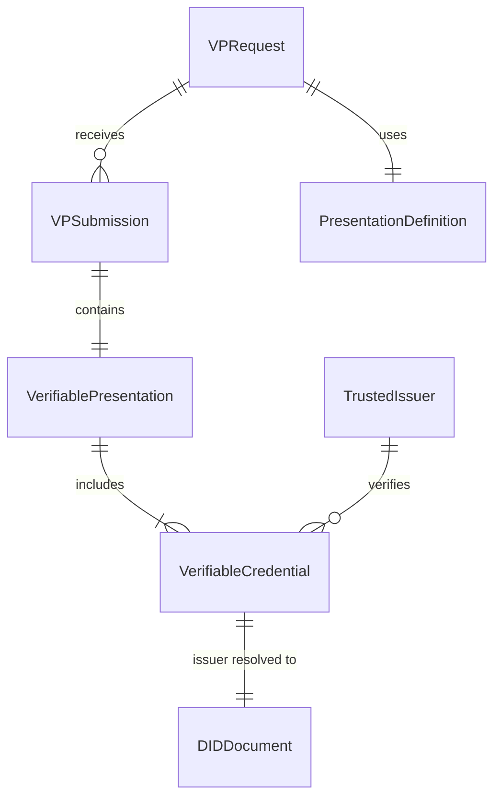

# OpenID4VP Model Package

## Package: `org.wso2.carbon.identity.openid4vc.presentation.model`

This package contains all domain model classes representing the core entities in the OpenID4VP flow.

---

## Model Overview

| Model | Purpose |
|-------|---------|
| VPRequest | VP authorization request session |
| VPRequestStatus | Request status enum |
| VPSubmission | Wallet VP submission |
| VerifiablePresentation | Parsed VP structure |
| VerifiableCredential | Parsed VC structure |
| PresentationDefinition | DIF Presentation Definition |
| DIDDocument | W3C DID Document |
| TrustedIssuer | Trusted issuer config |
| TrustedVerifier | Trusted verifier config |

---

## Detailed Model Documentation

### 1. VPRequest.java

**Location:** [VPRequest.java](file:///Users/udeepa/Desktop/VC/repos/identity-openid4vc/components/org.wso2.carbon.identity.openid4vc.presentation/src/main/java/org/wso2/carbon/identity/openid4vc/presentation/model/VPRequest.java)

**Purpose:** Represents a VP authorization request session.

#### Fields

| Field | Type | Description |
|-------|------|-------------|
| `id` | String | Unique request ID |
| `nonce` | String | Cryptographic nonce for replay protection |
| `state` | String | State parameter for session correlation |
| `clientId` | String | Verifier's client ID (DID) |
| `responseUri` | String | Where wallet should submit VP |
| `presentationDefinitionId` | String | Reference to presentation definition |
| `status` | VPRequestStatus | Current status |
| `createdAt` | Timestamp | Creation time |
| `expiresAt` | Timestamp | Expiry time |
| `tenantId` | int | Tenant identifier |

#### Usage

```java
VPRequest request = new VPRequest();
request.setId(UUID.randomUUID().toString());
request.setNonce(SecureRandomUtil.generateNonce());
request.setState(SecureRandomUtil.generateState());
request.setStatus(VPRequestStatus.PENDING);
request.setExpiresAt(Instant.now().plusSeconds(300));
```

---

### 2. VPRequestStatus.java

**Location:** [VPRequestStatus.java](file:///Users/udeepa/Desktop/VC/repos/identity-openid4vc/components/org.wso2.carbon.identity.openid4vc.presentation/src/main/java/org/wso2/carbon/identity/openid4vc/presentation/model/VPRequestStatus.java)

**Purpose:** Enum representing VP request lifecycle states.

#### Values

| Value | Description |
|-------|-------------|
| `PENDING` | Request created, waiting for wallet |
| `COMPLETED` | VP submitted and verified successfully |
| `FAILED` | Verification failed |
| `EXPIRED` | Request expired (timeout) |
| `CANCELLED` | User cancelled the request |

---

### 3. VPSubmission.java

**Location:** [VPSubmission.java](file:///Users/udeepa/Desktop/VC/repos/identity-openid4vc/components/org.wso2.carbon.identity.openid4vc.presentation/src/main/java/org/wso2/carbon/identity/openid4vc/presentation/model/VPSubmission.java)

**Purpose:** Represents a wallet's VP submission.

#### Fields

| Field | Type | Description |
|-------|------|-------------|
| `id` | String | Submission ID |
| `requestId` | String | Associated request ID |
| `vpToken` | String | Raw VP token (JWT/JSON) |
| `presentationSubmission` | String | Presentation submission JSON |
| `verificationResult` | VCVerificationStatus | Result of verification |
| `submittedAt` | Timestamp | Submission time |
| `walletMetadata` | String | Optional wallet info |

---

### 4. VerifiablePresentation.java

**Location:** [VerifiablePresentation.java](file:///Users/udeepa/Desktop/VC/repos/identity-openid4vc/components/org.wso2.carbon.identity.openid4vc.presentation/src/main/java/org/wso2/carbon/identity/openid4vc/presentation/model/VerifiablePresentation.java)

**Purpose:** Parsed Verifiable Presentation structure.

#### Fields

| Field | Type | Description |
|-------|------|-------------|
| `id` | String | VP ID (jti claim) |
| `holder` | String | Holder DID |
| `type` | List<String> | VP types |
| `verifiableCredential` | List<VerifiableCredential> | Contained VCs |
| `proof` | Proof | VP signature proof |
| `nonce` | String | Challenge nonce |

#### JSON-LD Structure

```json
{
  "@context": ["https://www.w3.org/2018/credentials/v1"],
  "type": ["VerifiablePresentation"],
  "holder": "did:key:z6MkhaXgBZD...",
  "verifiableCredential": [ ... ],
  "proof": {
    "type": "Ed25519Signature2020",
    "created": "2025-01-20T09:00:00Z",
    "proofValue": "..."
  }
}
```

#### JWT Structure

```
Header: { "alg": "EdDSA", "typ": "JWT" }
Payload: {
  "iss": "did:key:z6MkhaXgBZD...",
  "aud": "did:web:verifier.example.com",
  "nonce": "n-0S6_WzA2Mj",
  "vp": {
    "@context": [...],
    "type": ["VerifiablePresentation"],
    "verifiableCredential": [...]
  }
}
```

---

### 5. VerifiableCredential.java

**Location:** [VerifiableCredential.java](file:///Users/udeepa/Desktop/VC/repos/identity-openid4vc/components/org.wso2.carbon.identity.openid4vc.presentation/src/main/java/org/wso2/carbon/identity/openid4vc/presentation/model/VerifiableCredential.java)

**Purpose:** Parsed Verifiable Credential structure.

#### Fields

| Field | Type | Description |
|-------|------|-------------|
| `id` | String | VC ID |
| `type` | List<String> | VC types (e.g., "EmployeeCredential") |
| `issuer` | String | Issuer DID |
| `issuanceDate` | Instant | When issued |
| `expirationDate` | Instant | When expires |
| `credentialSubject` | Map | Subject claims |
| `credentialStatus` | CredentialStatus | Revocation info |
| `proof` | Proof | Issuer signature |
| `rawJwt` | String | Original JWT if JWT format |

#### Credential Subject Example

```json
{
  "id": "did:key:z6MksubjectDID...",
  "email": "employee@company.com",
  "employeeId": "EMP001",
  "department": "Engineering"
}
```

---

### 6. DIDDocument.java

**Location:** [DIDDocument.java](file:///Users/udeepa/Desktop/VC/repos/identity-openid4vc/components/org.wso2.carbon.identity.openid4vc.presentation/src/main/java/org/wso2/carbon/identity/openid4vc/presentation/model/DIDDocument.java)

**Purpose:** W3C DID Document representation.

#### Fields

| Field | Type | Description |
|-------|------|-------------|
| `id` | String | DID |
| `context` | List<String> | JSON-LD context |
| `verificationMethod` | List<VerificationMethod> | Public keys |
| `authentication` | List<String> | Auth key references |
| `assertionMethod` | List<String> | Assertion key references |

#### Verification Method

```json
{
  "id": "did:web:example.com#key-1",
  "type": "Ed25519VerificationKey2020",
  "controller": "did:web:example.com",
  "publicKeyMultibase": "z6MkhaXgBZDvotDUGr..."
}
```

---

### 7. PresentationDefinition.java

**Location:** [PresentationDefinition.java](file:///Users/udeepa/Desktop/VC/repos/identity-openid4vc/components/org.wso2.carbon.identity.openid4vc.presentation/src/main/java/org/wso2/carbon/identity/openid4vc/presentation/model/PresentationDefinition.java)

**Purpose:** DIF Presentation Definition model.

#### Fields

| Field | Type | Description |
|-------|------|-------------|
| `id` | String | Definition ID |
| `name` | String | Human-readable name |
| `purpose` | String | Why credentials are needed |
| `definitionJson` | String | Full JSON string |
| `tenantId` | int | Tenant identifier |

---

### 8. TrustedIssuer.java

**Location:** [TrustedIssuer.java](file:///Users/udeepa/Desktop/VC/repos/identity-openid4vc/components/org.wso2.carbon.identity.openid4vc.presentation/src/main/java/org/wso2/carbon/identity/openid4vc/presentation/model/TrustedIssuer.java)

**Purpose:** Configuration for trusted credential issuers.

#### Fields

| Field | Type | Description |
|-------|------|-------------|
| `id` | String | Issuer ID |
| `issuerDid` | String | Issuer's DID |
| `name` | String | Display name |
| `credentialTypes` | List<String> | Accepted credential types |
| `tenantId` | int | Tenant identifier |

---

### 9. VCVerificationStatus.java

**Location:** [VCVerificationStatus.java](file:///Users/udeepa/Desktop/VC/repos/identity-openid4vc/components/org.wso2.carbon.identity.openid4vc.presentation/src/main/java/org/wso2/carbon/identity/openid4vc/presentation/model/VCVerificationStatus.java)

**Purpose:** Enum for VC verification result.

#### Values

| Value | Description |
|-------|-------------|
| `VALID` | All checks passed |
| `INVALID_SIGNATURE` | Signature verification failed |
| `EXPIRED` | VC has expired |
| `REVOKED` | VC is revoked |
| `UNTRUSTED_ISSUER` | Issuer not in trusted list |
| `CONSTRAINT_VIOLATION` | Doesn't match constraints |

---

## Model Relationships


