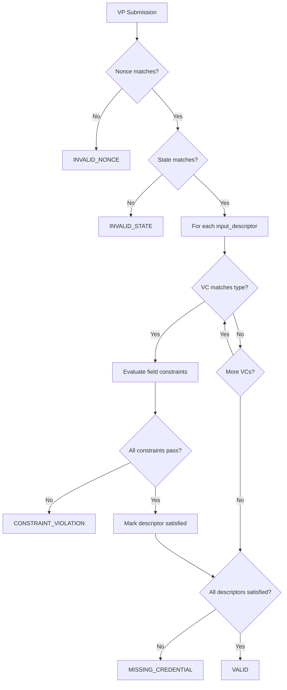

# OpenID4VP Utility Package

## Package: `org.wso2.carbon.identity.openid4vc.presentation.util`

This package contains utility classes for cryptographic operations, validation, QR code generation, and helper functions.

---

## Utility Overview

| Utility | Purpose |
|---------|---------|
| SignatureVerifier | JWT signature verification |
| VPSubmissionValidator | VP validation against definition |
| DIDKeyManager | Ed25519 key pair management |
| BCEd25519Signer | Bouncy Castle EdDSA signer |
| QRCodeUtil | QR code generation |
| OpenID4VPUtil | General helper methods |
| PresentationDefinitionUtil | Definition parsing |
| SecurityUtils | Crypto helpers |
| CORSUtil | CORS header management |
| OpenID4VPLogger | Structured logging |

---

## Detailed Utility Documentation

### 1. SignatureVerifier.java

**Location:** [SignatureVerifier.java](file:///Users/udeepa/Desktop/VC/repos/identity-openid4vc/components/org.wso2.carbon.identity.openid4vc.presentation/src/main/java/org/wso2/carbon/identity/openid4vc/presentation/util/SignatureVerifier.java)

**Purpose:** Verifies JWT signatures using resolved DID public keys.

#### Key Methods

| Method | Description |
|--------|-------------|
| `verifySignature(jwt, publicKey)` | Verifies JWT with given key |
| `verifyWithDID(jwt, did)` | Resolves DID and verifies |
| `getAlgorithmFromJWT(jwt)` | Extracts algorithm from header |

#### Supported Algorithms

| Algorithm | Key Type | Library |
|-----------|----------|---------|
| `EdDSA` | Ed25519 | Bouncy Castle |
| `ES256` | P-256 ECDSA | Nimbus JOSE+JWT |
| `ES384` | P-384 ECDSA | Nimbus JOSE+JWT |
| `RS256` | RSA 2048+ | Nimbus JOSE+JWT |

#### Verification Flow

```java
public boolean verifySignature(String jwt, String issuerDid) {
    // 1. Parse JWT header
    JWSHeader header = JWSHeader.parse(Base64URL.decode(jwt.split("\\.")[0]));
    String algorithm = header.getAlgorithm().getName();
    
    // 2. Get key ID from header or use default
    String keyId = header.getKeyID();
    
    // 3. Resolve DID document
    DIDDocument didDoc = didResolverService.resolve(issuerDid);
    
    // 4. Get verification method
    VerificationMethod vm = didDoc.getVerificationMethod(keyId);
    
    // 5. Verify based on algorithm
    if ("EdDSA".equals(algorithm)) {
        return verifyEdDSA(jwt, vm.getPublicKeyMultibase());
    } else if ("ES256".equals(algorithm)) {
        return verifyES256(jwt, vm.getPublicKeyJwk());
    }
    // ...
}
```

---

### 2. VPSubmissionValidator.java

**Location:** [VPSubmissionValidator.java](file:///Users/udeepa/Desktop/VC/repos/identity-openid4vc/components/org.wso2.carbon.identity.openid4vc.presentation/src/main/java/org/wso2/carbon/identity/openid4vc/presentation/util/VPSubmissionValidator.java)

**Purpose:** Validates VP submissions against presentation definitions.

#### Key Methods

| Method | Description |
|--------|-------------|
| `validate(vp, definition)` | Full validation |
| `validateNonce(vp, expected)` | Nonce check |
| `validateCredentialAgainstDescriptor(vc, descriptor)` | Field constraints |
| `evaluateJSONPathConstraint(vc, path, filter)` | JSONPath filter |

#### Validation Pipeline



#### JSONPath Constraint Example

```json
{
  "path": ["$.vc.credentialSubject.department"],
  "filter": {
    "type": "string",
    "const": "Engineering"
  }
}
```

```java
// Evaluates to: vc.credentialSubject.department == "Engineering"
```

---

### 3. DIDKeyManager.java

**Location:** [DIDKeyManager.java](file:///Users/udeepa/Desktop/VC/repos/identity-openid4vc/components/org.wso2.carbon.identity.openid4vc.presentation/src/main/java/org/wso2/carbon/identity/openid4vc/presentation/util/DIDKeyManager.java)

**Purpose:** Manages Ed25519 key pairs for the verifier's DID.

#### Key Methods

| Method | Description |
|--------|-------------|
| `getKeyPair()` | Returns or generates key pair |
| `getPublicKeyMultibase()` | Public key in multibase format |
| `getPrivateKey()` | Private key for signing |
| `getDIDKey()` | Returns `did:key:z6Mk...` |

#### Key Storage

Keys are stored in the IS keystore:
- Alias: `openid4vp-signing-key`
- Algorithm: Ed25519

```java
public KeyPair getKeyPair() {
    // 1. Try to load from keystore
    KeyPair stored = loadFromKeystore("openid4vp-signing-key");
    if (stored != null) {
        return stored;
    }
    
    // 2. Generate new key pair
    KeyPairGenerator keyGen = KeyPairGenerator.getInstance("Ed25519");
    KeyPair newPair = keyGen.generateKeyPair();
    
    // 3. Store in keystore
    storeInKeystore("openid4vp-signing-key", newPair);
    
    return newPair;
}
```

---

### 4. BCEd25519Signer.java

**Location:** [BCEd25519Signer.java](file:///Users/udeepa/Desktop/VC/repos/identity-openid4vc/components/org.wso2.carbon.identity.openid4vc.presentation/src/main/java/org/wso2/carbon/identity/openid4vc/presentation/util/BCEd25519Signer.java)

**Purpose:** Bouncy Castle implementation of EdDSA JWT signer.

#### Usage

```java
// Create signer
BCEd25519Signer signer = new BCEd25519Signer(privateKey);

// Create and sign JWT
JWSObject jwsObject = new JWSObject(
    new JWSHeader(JWSAlgorithm.EdDSA),
    new Payload(claims)
);
jwsObject.sign(signer);

String signedJwt = jwsObject.serialize();
```

---

### 5. QRCodeUtil.java

**Location:** [QRCodeUtil.java](file:///Users/udeepa/Desktop/VC/repos/identity-openid4vc/components/org.wso2.carbon.identity.openid4vc.presentation/src/main/java/org/wso2/carbon/identity/openid4vc/presentation/util/QRCodeUtil.java)

**Purpose:** Generates QR codes for OpenID4VP authorization requests.

#### Key Methods

| Method | Description |
|--------|-------------|
| `generateQRCode(content, size)` | Creates QR code image |
| `generateQRCodeBase64(content)` | Base64 encoded image |
| `buildOpenID4VPUri(requestUri)` | Builds `openid4vp://` URI |

#### QR Code Content

```
openid4vp://authorize?
  client_id=did:web:verifier.example.com&
  request_uri=https://is.example.com/openid4vp/v1/request-uri/req_abc123
```

#### Usage

```java
String requestUri = "https://is.example.com/openid4vp/v1/request-uri/req_abc123";
String openid4vpUri = QRCodeUtil.buildOpenID4VPUri(requestUri);
String qrBase64 = QRCodeUtil.generateQRCodeBase64(openid4vpUri);

// Returns: "data:image/png;base64,iVBORw0KGgo..."
```

---

### 6. OpenID4VPUtil.java

**Location:** [OpenID4VPUtil.java](file:///Users/udeepa/Desktop/VC/repos/identity-openid4vc/components/org.wso2.carbon.identity.openid4vc.presentation/src/main/java/org/wso2/carbon/identity/openid4vc/presentation/util/OpenID4VPUtil.java)

**Purpose:** General helper methods for OpenID4VP.

#### Key Methods

| Method | Description |
|--------|-------------|
| `generateNonce()` | Secure random nonce |
| `generateState()` | Secure random state |
| `parseJWTPayload(jwt)` | Decode JWT payload |
| `buildResponseUri(baseUrl)` | Build response endpoint URL |
| `getConfigValue(key)` | Read from IS config |

---

### 7. PresentationDefinitionUtil.java

**Location:** [PresentationDefinitionUtil.java](file:///Users/udeepa/Desktop/VC/repos/identity-openid4vc/components/org.wso2.carbon.identity.openid4vc.presentation/src/main/java/org/wso2/carbon/identity/openid4vc/presentation/util/PresentationDefinitionUtil.java)

**Purpose:** Parse and validate presentation definitions.

#### Key Methods

| Method | Description |
|--------|-------------|
| `parse(json)` | Parse definition JSON |
| `validate(definition)` | Validate structure |
| `getInputDescriptors(definition)` | Extract descriptors |
| `matchCredentialType(vc, descriptor)` | Type matching |

---

### 8. SecurityUtils.java

**Location:** [SecurityUtils.java](file:///Users/udeepa/Desktop/VC/repos/identity-openid4vc/components/org.wso2.carbon.identity.openid4vc.presentation/src/main/java/org/wso2/carbon/identity/openid4vc/presentation/util/SecurityUtils.java)

**Purpose:** Common cryptographic utility functions.

#### Key Methods

| Method | Description |
|--------|-------------|
| `generateSecureRandom(bytes)` | Secure random bytes |
| `base64UrlEncode(data)` | URL-safe base64 |
| `base64UrlDecode(data)` | Decode base64url |
| `hashSHA256(data)` | SHA-256 hash |
| `decodeMultibase(encoded)` | Decode multibase string |

---

### 9. CORSUtil.java

**Location:** [CORSUtil.java](file:///Users/udeepa/Desktop/VC/repos/identity-openid4vc/components/org.wso2.carbon.identity.openid4vc.presentation/src/main/java/org/wso2/carbon/identity/openid4vc/presentation/util/CORSUtil.java)

**Purpose:** Manage CORS headers for servlet responses.

#### Usage

```java
public void doOptions(HttpServletRequest request, HttpServletResponse response) {
    CORSUtil.addCORSHeaders(response);
    response.setStatus(HttpServletResponse.SC_OK);
}

public void doPost(HttpServletRequest request, HttpServletResponse response) {
    CORSUtil.addCORSHeaders(response);
    // ... handle request
}
```

#### Headers Added

```
Access-Control-Allow-Origin: *
Access-Control-Allow-Methods: GET, POST, PUT, DELETE, OPTIONS
Access-Control-Allow-Headers: Content-Type, Authorization
Access-Control-Max-Age: 3600
```

---

### 10. OpenID4VPLogger.java

**Location:** [OpenID4VPLogger.java](file:///Users/udeepa/Desktop/VC/repos/identity-openid4vc/components/org.wso2.carbon.identity.openid4vc.presentation/src/main/java/org/wso2/carbon/identity/openid4vc/presentation/util/OpenID4VPLogger.java)

**Purpose:** Structured logging for OpenID4VP operations.

#### Log Events

| Event | Level | Data |
|-------|-------|------|
| VP_REQUEST_CREATED | INFO | requestId, clientId |
| VP_SUBMISSION_RECEIVED | INFO | requestId, format |
| VC_VERIFICATION_SUCCESS | INFO | issuer, type |
| VC_VERIFICATION_FAILED | WARN | issuer, reason |
| AUTHENTICATION_SUCCESS | INFO | userId, method |
