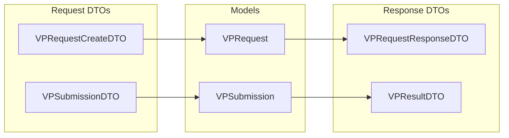

# OpenID4VP DTO Package

## Package: `org.wso2.carbon.identity.openid4vc.presentation.dto`

This package contains Data Transfer Objects for API request/response payloads.

---

## DTO Overview

| DTO | Purpose | Direction |
|-----|---------|-----------|
| VPRequestCreateDTO | Create VP request input | Request |
| VPRequestResponseDTO | VP request info output | Response |
| VPSubmissionDTO | Wallet submission input | Request |
| VPResultDTO | Verification result output | Response |
| VPStatusResponseDTO | Polling status output | Response |
| PresentationSubmissionDTO | DIF submission format | Request |
| DescriptorMapDTO | Input descriptor mapping | Request |
| ErrorDTO | Error response | Response |

---

## Detailed DTO Documentation

### 1. VPRequestCreateDTO.java

**Purpose:** Input for creating a new VP request.

#### Fields

| Field | Type | Required | Description |
|-------|------|----------|-------------|
| `presentationDefinitionId` | String | No | Definition to use |
| `callbackUrl` | String | No | Where to redirect after |
| `clientId` | String | No | Override verifier DID |

#### Example

```json
{
  "presentationDefinitionId": "employee_verification",
  "callbackUrl": "https://app.example.com/callback"
}
```

---

### 2. VPRequestResponseDTO.java

**Purpose:** Response when VP request is created.

#### Fields

| Field | Type | Description |
|-------|------|-------------|
| `requestId` | String | Unique request ID |
| `requestUri` | String | URL for wallet to fetch request |
| `qrCodeData` | String | `openid4vp://` URI for QR |
| `expiresAt` | String | ISO8601 expiry time |
| `status` | String | Current status |

#### Example

```json
{
  "requestId": "req_abc123",
  "requestUri": "https://is.example.com/openid4vp/v1/request-uri/req_abc123",
  "qrCodeData": "openid4vp://authorize?request_uri=...",
  "expiresAt": "2025-01-20T10:30:00Z",
  "status": "pending"
}
```

---

### 3. VPSubmissionDTO.java

**Purpose:** Wallet VP submission payload.

#### Fields

| Field | Type | Required | Description |
|-------|------|----------|-------------|
| `vpToken` | String | Yes | The VP token (JWT/JSON) |
| `presentationSubmission` | String | Yes | JSON presentation submission |
| `state` | String | Yes | State from request |
| `idToken` | String | No | Optional ID token |

#### Example

```json
{
  "vp_token": "eyJhbGciOiJFZERTQSIsInR5cCI6IkpXVCJ9...",
  "presentation_submission": {
    "id": "ps_1",
    "definition_id": "employee_verification",
    "descriptor_map": [...]
  },
  "state": "af0ifjsldkj"
}
```

---

### 4. PresentationSubmissionDTO.java

**Purpose:** DIF Presentation Exchange submission format.

#### Fields

| Field | Type | Description |
|-------|------|-------------|
| `id` | String | Submission ID |
| `definitionId` | String | Referenced definition ID |
| `descriptorMap` | List<DescriptorMapDTO> | Credential mappings |

#### Example

```json
{
  "id": "submission_1",
  "definition_id": "employee_verification",
  "descriptor_map": [
    {
      "id": "employee_vc",
      "format": "jwt_vp",
      "path": "$",
      "path_nested": {
        "format": "jwt_vc_json",
        "path": "$.vp.verifiableCredential[0]"
      }
    }
  ]
}
```

---

### 5. DescriptorMapDTO.java

**Purpose:** Maps credentials to input descriptors.

#### Fields

| Field | Type | Description |
|-------|------|-------------|
| `id` | String | Input descriptor ID |
| `format` | String | Credential format |
| `path` | String | JSONPath to VP |
| `pathNested` | PathNestedDTO | Path to VC within VP |

---

### 6. VPResultDTO.java

**Purpose:** Final verification result.

#### Fields

| Field | Type | Description |
|-------|------|-------------|
| `valid` | boolean | Overall validity |
| `verifiableCredentials` | List<VCVerificationResultDTO> | Per-VC results |
| `holder` | String | Holder DID |
| `submittedAt` | String | Submission timestamp |

#### Example

```json
{
  "valid": true,
  "verifiableCredentials": [
    {
      "type": ["VerifiableCredential", "EmployeeCredential"],
      "issuer": "did:web:issuer.example.com",
      "valid": true,
      "revoked": false,
      "claims": {
        "email": "employee@company.com",
        "department": "Engineering"
      }
    }
  ],
  "holder": "did:key:z6MkhaXgBZDv...",
  "submittedAt": "2025-01-20T09:15:00Z"
}
```

---

### 7. VCVerificationResultDTO.java

**Purpose:** Individual VC verification result.

#### Fields

| Field | Type | Description |
|-------|------|-------------|
| `type` | List<String> | VC types |
| `issuer` | String | Issuer DID |
| `valid` | boolean | Signature valid |
| `expired` | boolean | Expiration status |
| `revoked` | boolean | Revocation status |
| `claims` | Map | Credential subject |
| `error` | String | Error if invalid |

---

### 8. VPStatusResponseDTO.java

**Purpose:** Polling status response.

#### Fields

| Field | Type | Description |
|-------|------|-------------|
| `status` | String | pending/completed/failed/expired |
| `error` | String | Error code if failed |
| `errorDescription` | String | Error message |
| `submissionId` | String | Submission ID if completed |

#### Examples

```json
// Pending
{ "status": "pending" }

// Completed
{ 
  "status": "completed",
  "submissionId": "sub_xyz789"
}

// Failed
{
  "status": "failed",
  "error": "invalid_proof",
  "errorDescription": "Signature verification failed"
}
```

---

### 9. ErrorDTO.java

**Purpose:** Standard error response format.

#### Fields

| Field | Type | Description |
|-------|------|-------------|
| `error` | String | OAuth2 error code |
| `errorDescription` | String | Human-readable message |

#### Example

```json
{
  "error": "invalid_request",
  "error_description": "Missing required parameter: vp_token"
}
```

---

## DTO Mapping


