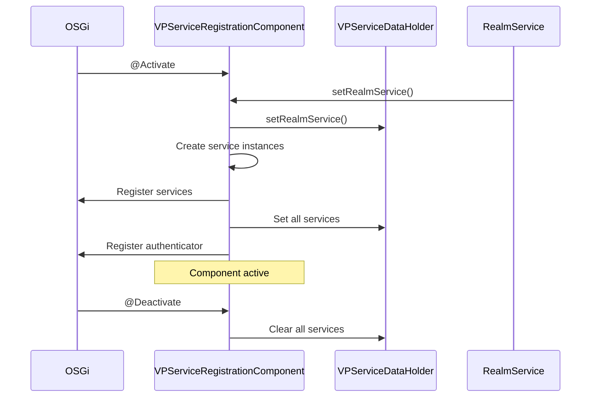

# OpenID4VP Constants & Internal Packages

## Constants Package

### Package: `org.wso2.carbon.identity.openid4vc.presentation.constant`

**File:** [OpenID4VPConstants.java](file:///Users/udeepa/Desktop/VC/repos/identity-openid4vc/components/org.wso2.carbon.identity.openid4vc.presentation/src/main/java/org/wso2/carbon/identity/openid4vc/presentation/constant/OpenID4VPConstants.java)

Central repository for all constants used throughout the OpenID4VP component.

---

### Nested Classes

#### 1. Protocol

OpenID4VP protocol constants:

| Constant | Value | Description |
|----------|-------|-------------|
| `RESPONSE_TYPE_VP_TOKEN` | `"vp_token"` | VP token response type |
| `RESPONSE_MODE_DIRECT_POST` | `"direct_post"` | Direct POST mode |
| `RESPONSE_MODE_DIRECT_POST_JWT` | `"direct_post.jwt"` | Signed response |
| `CLIENT_ID_SCHEME_DID` | `"did"` | DID client ID scheme |
| `PRESENTATION_DEFINITION` | `"presentation_definition"` | Inline definition |
| `PRESENTATION_DEFINITION_URI` | `"presentation_definition_uri"` | Reference by URI |

---

#### 2. RequestParams

Request parameter names:

| Constant | Value |
|----------|-------|
| `CLIENT_ID` | `"client_id"` |
| `RESPONSE_TYPE` | `"response_type"` |
| `RESPONSE_MODE` | `"response_mode"` |
| `RESPONSE_URI` | `"response_uri"` |
| `NONCE` | `"nonce"` |
| `STATE` | `"state"` |
| `SCOPE` | `"scope"` |
| `VP_TOKEN` | `"vp_token"` |
| `PRESENTATION_SUBMISSION` | `"presentation_submission"` |

---

#### 3. ResponseParams

Response parameter names:

| Constant | Value |
|----------|-------|
| `VP_TOKEN` | `"vp_token"` |
| `PRESENTATION_SUBMISSION` | `"presentation_submission"` |
| `ERROR` | `"error"` |
| `ERROR_DESCRIPTION` | `"error_description"` |
| `STATE` | `"state"` |

---

#### 4. ErrorCodes

OAuth2/OpenID4VP error codes:

| Constant | Value | HTTP Status |
|----------|-------|-------------|
| `INVALID_REQUEST` | `"invalid_request"` | 400 |
| `INVALID_PRESENTATION` | `"invalid_presentation"` | 400 |
| `PRESENTATION_EXPIRED` | `"presentation_expired"` | 400 |
| `ACCESS_DENIED` | `"access_denied"` | 403 |
| `SERVER_ERROR` | `"server_error"` | 500 |
| `TEMPORARILY_UNAVAILABLE` | `"temporarily_unavailable"` | 503 |
| `USER_CANCELLED` | `"user_cancelled"` | 400 |
| `CREDENTIAL_NOT_AVAILABLE` | `"credential_not_available"` | 400 |

---

#### 5. VCFormats

Verifiable Credential format identifiers:

| Constant | Value | Description |
|----------|-------|-------------|
| `JWT_VP` | `"jwt_vp"` | JWT VP |
| `JWT_VC_JSON` | `"jwt_vc_json"` | JWT VC with JSON payload |
| `LDP_VP` | `"ldp_vp"` | JSON-LD VP |
| `LDP_VC` | `"ldp_vc"` | JSON-LD VC |
| `VC_SD_JWT` | `"vc+sd-jwt"` | SD-JWT VC |
| `MSO_MDOC` | `"mso_mdoc"` | Mobile Document |

---

#### 6. JWTClaims

Standard JWT claim names:

| Constant | Value |
|----------|-------|
| `ISS` | `"iss"` |
| `SUB` | `"sub"` |
| `AUD` | `"aud"` |
| `EXP` | `"exp"` |
| `IAT` | `"iat"` |
| `NBF` | `"nbf"` |
| `JTI` | `"jti"` |
| `NONCE` | `"nonce"` |
| `VP` | `"vp"` |
| `VC` | `"vc"` |

---

#### 7. HTTP

HTTP-related constants:

| Constant | Value |
|----------|-------|
| `CONTENT_TYPE_JSON` | `"application/json"` |
| `CONTENT_TYPE_JWT` | `"application/jwt"` |
| `CONTENT_TYPE_FORM` | `"application/x-www-form-urlencoded"` |
| `AUTHORIZATION_HEADER` | `"Authorization"` |
| `BEARER_PREFIX` | `"Bearer "` |

---

#### 8. Endpoints

API endpoint paths:

| Constant | Value |
|----------|-------|
| `AUTHORIZE` | `"/authorize"` |
| `VP_REQUEST` | `"/vp-request"` |
| `VP_RESPONSE` | `"/response"` |
| `VP_STATUS` | `"/status"` |
| `VP_RESULT` | `"/vp-result"` |
| `PRESENTATION_DEFINITIONS` | `"/presentation-definitions"` |
| `REQUEST_URI` | `"/request-uri"` |

---

#### 9. ConfigKeys

Configuration property keys:

| Constant | Value | Default |
|----------|-------|---------|
| `VP_REQUEST_EXPIRY_SECONDS` | `"OpenID4VP.VPRequestExpirySeconds"` | 300 |
| `ENABLE_REVOCATION_CHECK` | `"OpenID4VP.EnableRevocationCheck"` | true |
| `DEFAULT_PRESENTATION_DEFINITION_ID` | `"OpenID4VP.DefaultPresentationDefinitionId"` | (none) |
| `DID_METHOD` | `"OpenID4VP.DID.Method"` | `"web"` |
| `DID_UNIVERSAL_RESOLVER_URL` | `"OpenID4VP.DID.UniversalResolverUrl"` | (none) |
| `BASE_URL` | `"OpenID4VP.BaseUrl"` | (auto) |

---

## Internal Package

### Package: `org.wso2.carbon.identity.openid4vc.presentation.internal`

OSGi service registration and lifecycle management.

---

### Files

#### 1. VPServiceDataHolder.java

**Purpose:** Singleton holding all service references.

```java
public class VPServiceDataHolder {
    private static VPServiceDataHolder instance = new VPServiceDataHolder();
    
    private VPRequestService vpRequestService;
    private VPSubmissionService vpSubmissionService;
    private PresentationDefinitionService presentationDefinitionService;
    private VCVerificationService vcVerificationService;
    private DIDResolverService didResolverService;
    private RealmService realmService;
    private ApplicationManagementService applicationManagementService;
    
    public static VPServiceDataHolder getInstance() {
        return instance;
    }
    
    // Getters and setters...
}
```

---

#### 2. VPServiceRegistrationComponent.java

**Purpose:** Registers core services as OSGi services.

**Annotations:**
```java
@Component(
    name = "org.wso2.carbon.identity.openid4vc.presentation.service.component",
    immediate = true
)
```

**Registers:**
- VPRequestService
- VPSubmissionService
- PresentationDefinitionService
- ApplicationPresentationDefinitionMappingService
- OpenID4VPAuthenticator

---

#### 3. VPServletRegistrationComponent.java

**Purpose:** Registers HTTP servlets.

**Registered Servlets:**

| Servlet | Path |
|---------|------|
| VPRequestServlet | `/openid4vp/v1/request` |
| RequestUriServlet | `/openid4vp/v1/request-uri/*` |
| VPSubmissionServlet | `/openid4vp/v1/response` |
| VPStatusPollingServlet | `/openid4vp/v1/status/*` |
| VPResultServlet | `/openid4vp/v1/result/*` |
| VPDefinitionServlet | `/openid4vp/v1/presentation-definitions/*` |
| VCVerificationServlet | `/openid4vp/v1/verify` |
| WellKnownDIDServlet | `/.well-known/did.json` |

---

#### 4. WalletAuthenticatorServiceComponent.java

**Purpose:** Registers WalletAuthenticator.

---

#### 5. WalletServletRegistrationComponent.java

**Purpose:** Registers wallet-facing servlets.

**Registered Servlets:**

| Servlet | Path |
|---------|------|
| WalletResponseServlet | `/wallet/response` |
| WalletStatusServlet | `/wallet/status/*` |
| WalletTemplateServlet | `/wallet/template` |

---

## OSGi Lifecycle


