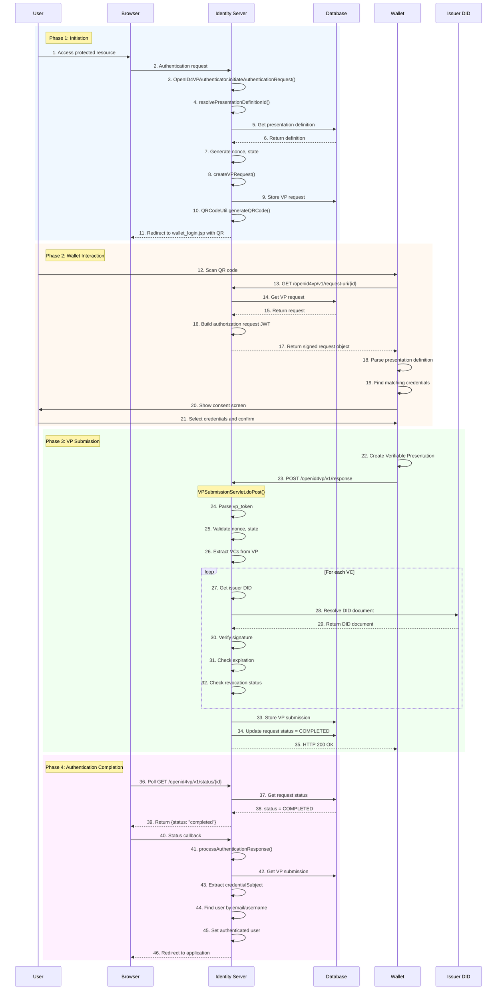
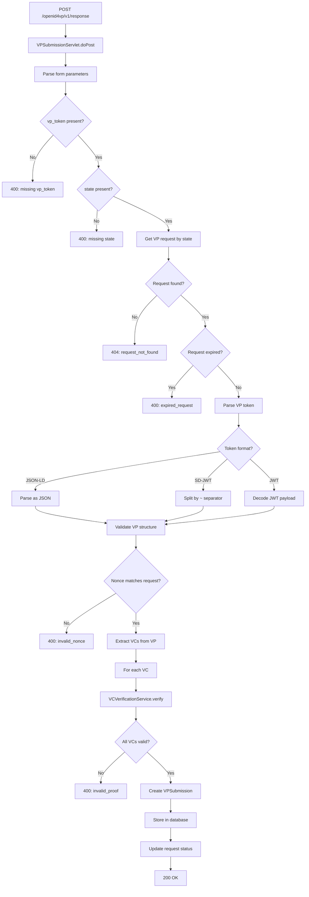
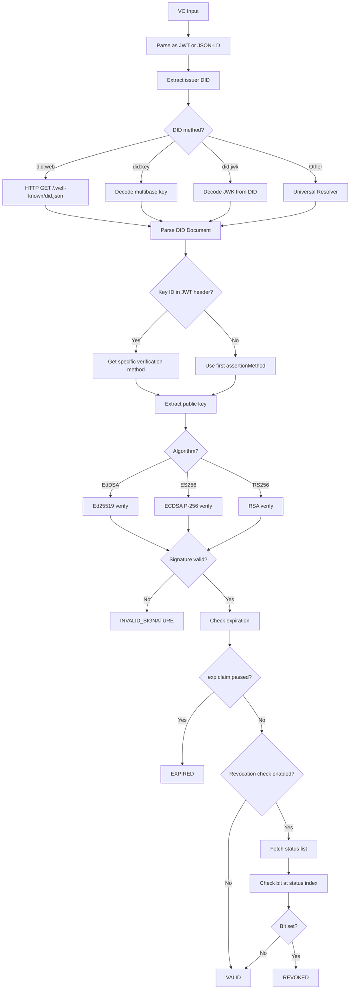
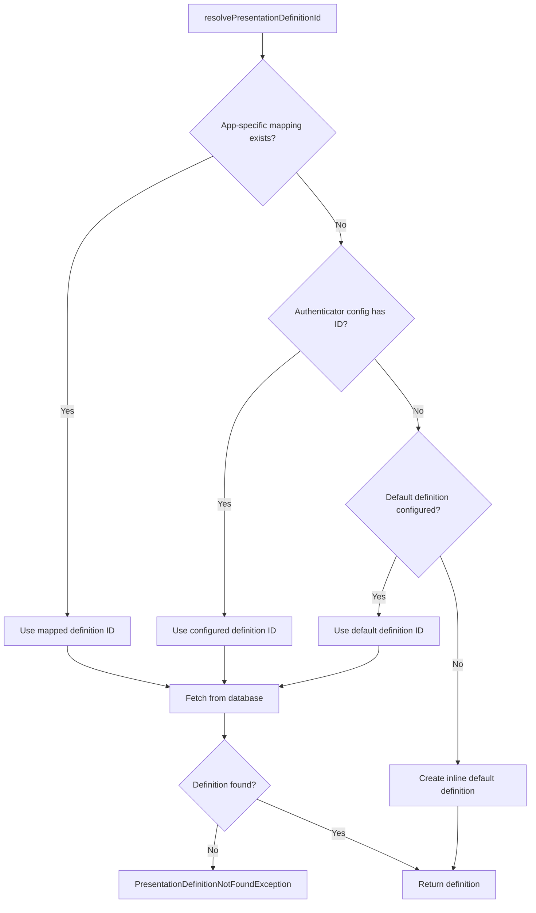
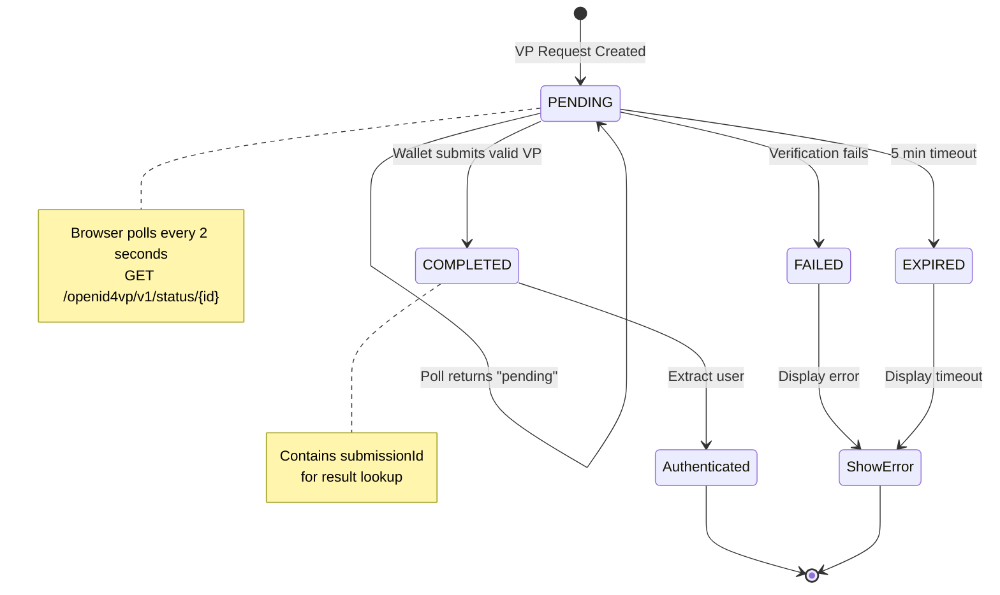
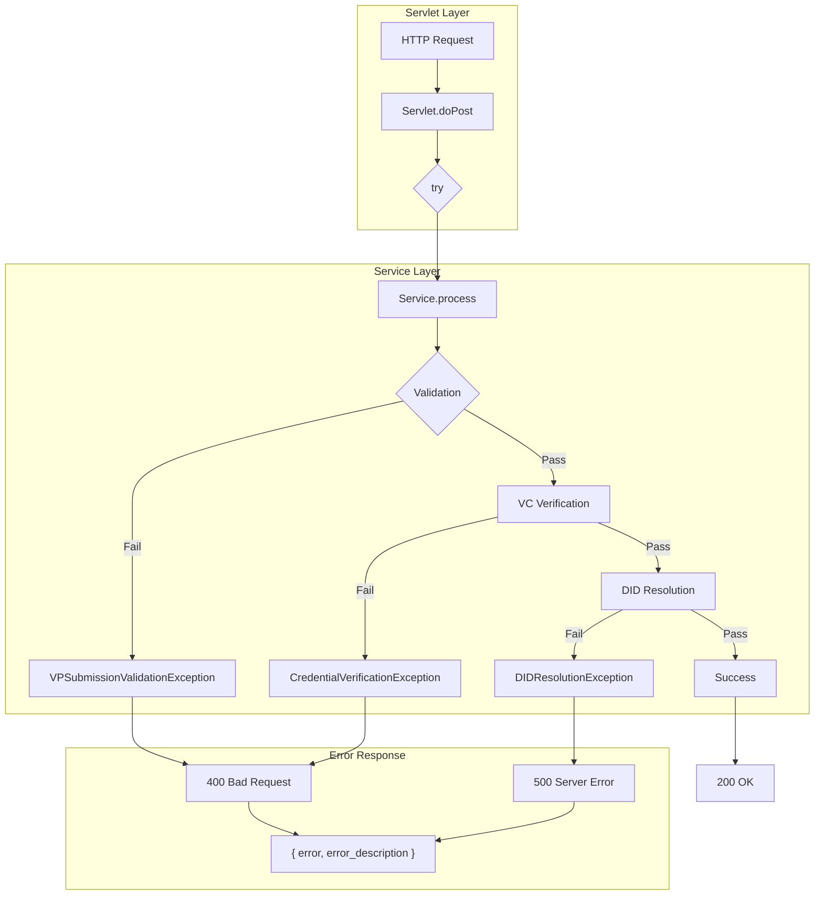

# OpenID4VP Runtime Flows

## Complete Authentication Flow Diagrams

This document provides detailed runtime flow diagrams for all major operations in the OpenID4VP component.

---

## Flow 1: Browser-Based Authentication (QR Code)

The primary use case - user scans QR code with mobile wallet.

---

## Flow 2: VP Submission Processing

Detailed breakdown of what happens when wallet submits VP.

---

## Flow 3: VC Signature Verification

How individual credentials are verified.

---

## Flow 4: Presentation Definition Resolution

How the authenticator determines which definition to use.

---

## Flow 5: Polling State Machine

Browser polls for VP submission status.

---

## Flow 6: Error Handling Chain

How errors propagate through the system.

---

## API Endpoint Summary

| Endpoint | Method | Purpose | Success | Error |
|----------|--------|---------|---------|-------|
| `/openid4vp/v1/request` | POST | Create VP request | 201 | 400 |
| `/openid4vp/v1/request-uri/{id}` | GET | Wallet fetches request | 200 | 404 |
| `/openid4vp/v1/response` | POST | Wallet submits VP | 200 | 400 |
| `/openid4vp/v1/status/{id}` | GET | Poll status | 200 | 404 |
| `/openid4vp/v1/result/{id}` | GET | Get result | 200 | 404 |
| `/.well-known/did.json` | GET | Verifier DID doc | 200 | 500 |
