# OpenID4VP Component Communication Architecture

This document explains how each internal component in the `org.wso2.carbon.identity.openid4vc.presentation` module communicates with other components.

---

## High-Level Architecture

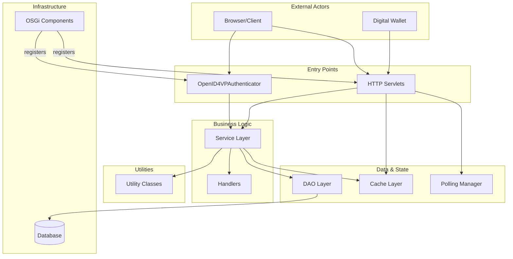

---

## Package Communication Matrix

| Source Package | Communicates With | Communication Type |
|----------------|-------------------|-------------------|
| `authenticator` | `service`, `cache`, `util`, `model`, `dto` | Method calls |
| `servlet` | `service`, `cache`, `polling`, `util`, `dto`, `exception` | Method calls |
| `service` | `dao`, `util`, `model`, `dto`, `exception`, `handler` | Method calls |
| `dao` | `model`, `exception` | Method calls |
| `cache` | `model`, `dto` | Data storage |
| `polling` | `cache`, `service` | Async coordination |
| `handler` | `model`, `dto`, `util` | Request/Response building |
| `internal` | All packages | OSGi registration |
| `util` | `model`, `exception`, `constant` | Stateless utilities |

---

## Component Details

### 1. Authenticator Package

**Files:** `OpenID4VPAuthenticator.java`

**Role:** WSO2 IS authentication framework integration point.

**Inbound Communication:**
- Called by WSO2 authentication framework during login flow
- Receives `HttpServletRequest`, `AuthenticationContext`

**Outbound Communication:**
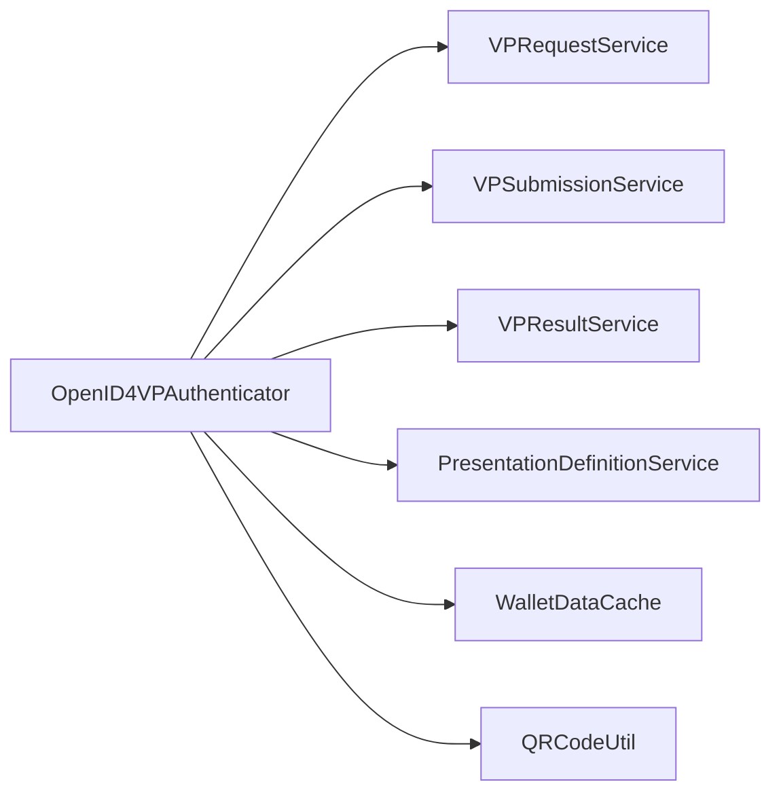

| Target | Method Called | Purpose |
|--------|--------------|---------|
| `VPRequestService` | `createVPRequest()` | Initiate VP authorization request |
| `VPSubmissionService` | `getSubmissionByRequestId()` | Check for wallet response |
| `VPResultService` | `getVPResult()` | Get verification result |
| `PresentationDefinitionService` | `getPresentationDefinition()` | Get credential requirements |
| `WalletDataCache` | `storeData()`, `getData()` | Session state management |
| `QRCodeUtil` | `generateQRContent()` | Generate `openid4vp://` URI |

---

### 2. Servlet Package

**Files:** 9 servlets handling HTTP endpoints

**Role:** HTTP API layer for wallets and browser clients

```mermaid
graph TB
    subgraph "Servlet Layer"
        VPReq[VPRequestServlet<br>/request]
        ReqUri[RequestUriServlet<br>/request-uri/{id}]
        VPSub[VPSubmissionServlet<br>/response]
        VPStat[VPStatusPollingServlet<br>/status/{id}]
        VPRes[VPResultServlet<br>/result/{id}]
        VPDef[VPDefinitionServlet<br>/presentation-definitions]
        VCVer[VCVerificationServlet<br>/verify]
        DID[WellKnownDIDServlet<br>/.well-known/did.json]
    end

    subgraph "Services"
        VPReqSvc[VPRequestService]
        VPSubSvc[VPSubmissionService]
        VPResSvc[VPResultService]
        PDSvc[PresentationDefinitionService]
        VCSvc[VCVerificationService]
        DIDSvc[DIDDocumentService]
    end

    VPReq --> VPReqSvc
    ReqUri --> VPReqSvc
    VPSub --> VPSubSvc
    VPStat --> VPReqSvc
    VPRes --> VPResSvc
    VPDef --> PDSvc
    VCVer --> VCSvc
    DID --> DIDSvc
```

**Servlet → Service Mapping:**

| Servlet | Primary Service | Purpose |
|---------|----------------|---------|
| `VPRequestServlet` | `VPRequestService` | Create VP authorization request |
| `RequestUriServlet` | `VPRequestService` | Return JWT request object to wallet |
| `VPSubmissionServlet` | `VPSubmissionService` | Receive and process wallet VP |
| `VPStatusPollingServlet` | `VPRequestService` | Return current request status |
| `VPResultServlet` | `VPResultService` | Return detailed verification result |
| `VPDefinitionServlet` | `PresentationDefinitionService` | CRUD presentation definitions |
| `VCVerificationServlet` | `VCVerificationService` | Standalone VC verification |
| `WellKnownDIDServlet` | `DIDDocumentService` | Return verifier DID document |

**Additional Servlet Dependencies:**

| Servlet | Also Uses |
|---------|----------|
| `VPSubmissionServlet` | `WalletDataCache`, `LongPollingManager`, `VPSubmissionValidator` |
| `VPStatusPollingServlet` | `LongPollingManager`, `WalletDataCache` |
| `WalletStatusServlet` | `WalletDataCache`, `LongPollingManager` |

---

### 3. Service Package

**Files:** 11 service interfaces + 11 implementations

**Role:** Core business logic layer

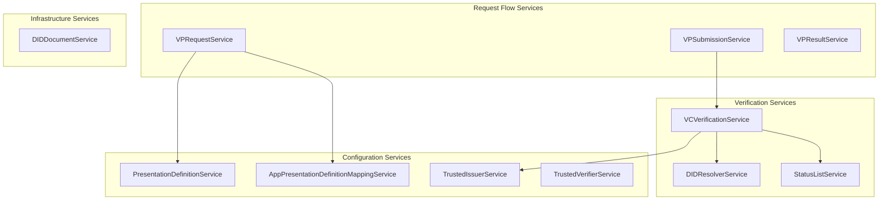

**Service Communication Patterns:**

| Service | Depends On | DAO Used |
|---------|-----------|----------|
| `VPRequestService` | `PresentationDefinitionService`, `VPRequestDAO` | `VPRequestDAO` |
| `VPSubmissionService` | `VCVerificationService`, `VPRequestService` | `VPSubmissionDAO` |
| `VPResultService` | `VPSubmissionService` | `VPSubmissionDAO` |
| `VCVerificationService` | `DIDResolverService`, `StatusListService`, `TrustedIssuerService` | None |
| `PresentationDefinitionService` | None | `PresentationDefinitionDAO` |
| `DIDResolverService` | External HTTP (Universal Resolver) | None |
| `StatusListService` | External HTTP (Status List endpoints) | None |

---

### 4. DAO Package

**Files:** 5 DAO interfaces + 5 implementations

**Role:** Database persistence layer

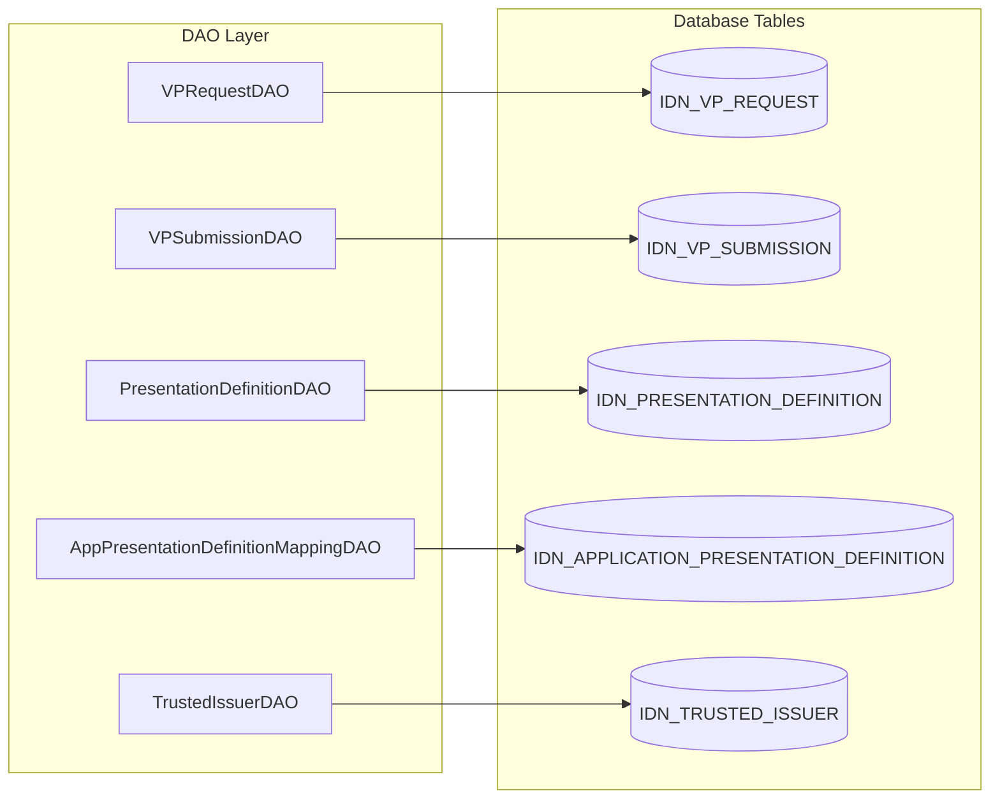

**DAO Methods:**

| DAO | Key Operations |
|-----|---------------|
| `VPRequestDAO` | `create()`, `get()`, `updateStatus()`, `delete()`, `deleteExpired()` |
| `VPSubmissionDAO` | `create()`, `getByRequestId()`, `getById()`, `delete()` |
| `PresentationDefinitionDAO` | `create()`, `get()`, `update()`, `delete()`, `list()` |
| `AppPresentationDefinitionMappingDAO` | `create()`, `getByAppId()`, `delete()` |
| `TrustedIssuerDAO` | `create()`, `getByDid()`, `list()`, `delete()` |

---

### 5. Cache Package

**Files:** `VPRequestCache`, `VPStatusListenerCache`, `WalletDataCache`

**Role:** In-memory state management for real-time flows

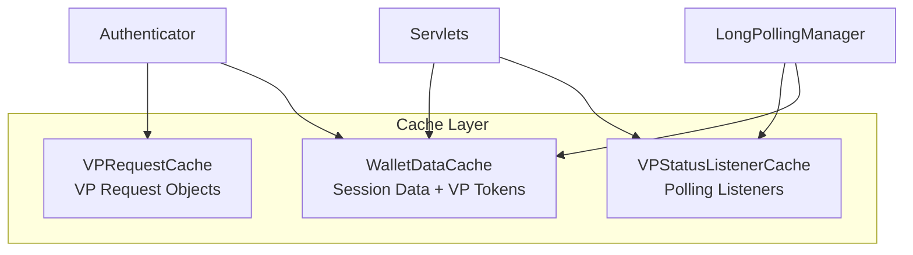

**Cache Usage:**

| Cache | Stores | Used By |
|-------|--------|---------|
| `VPRequestCache` | VP request objects | Authenticator (quick lookup during polling) |
| `VPStatusListenerCache` | Async response listeners | LongPollingManager, StatusPollingServlet |
| `WalletDataCache` | Session data, VP tokens, submissions | Authenticator, Servlets, LongPollingManager |

**Key WalletDataCache Methods:**
```java
storeVPRequest(requestId, vpRequest)
getVPRequest(requestId)
storeVPToken(requestId, vpToken)
getVPToken(requestId)
storeSubmission(requestId, submission)
getSubmission(requestId)
```

---

### 6. Polling Package

**Files:** `LongPollingManager`, `PollingResult`

**Role:** Coordinate async wait for wallet response

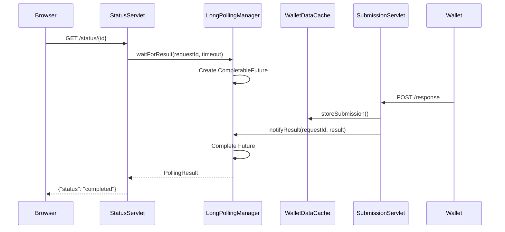

**LongPollingManager Methods:**
```java
waitForResult(requestId, timeoutSeconds) → PollingResult
notifyResult(requestId, pollingResult)
cancelWait(requestId)
```

---

### 7. Handler Package

**Files:** `VPRequestBuilder`, `VPResponseHandler`

**Role:** Construct/parse protocol messages

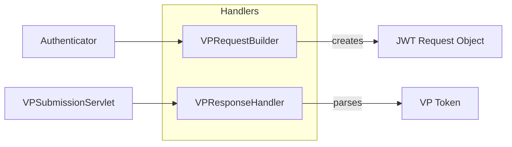

| Handler | Input | Output |
|---------|-------|--------|
| `VPRequestBuilder` | PresentationDefinition, config | Signed JWT authorization request |
| `VPResponseHandler` | VP Token, Presentation Submission | Parsed VerifiablePresentation, extracted VCs |

---

### 8. Util Package

**Files:** 10 utility classes

**Role:** Stateless helper functions

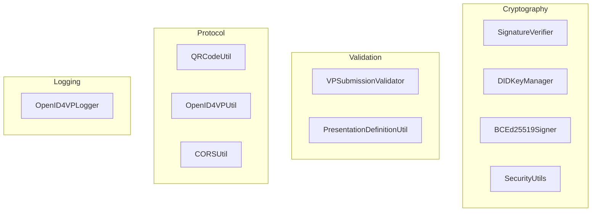

**Utility Dependencies:**

| Utility | Used By | Purpose |
|---------|---------|---------|
| `SignatureVerifier` | `VCVerificationService` | Verify JWT/VC signatures |
| `VPSubmissionValidator` | `VPSubmissionServlet`, `VPSubmissionService` | Validate VP against definition |
| `DIDKeyManager` | `DIDDocumentService`, `VPRequestBuilder` | Generate/manage Ed25519 keys |
| `BCEd25519Signer` | `VPRequestBuilder` | Sign JWT requests |
| `QRCodeUtil` | `OpenID4VPAuthenticator` | Generate QR code content |
| `PresentationDefinitionUtil` | `PresentationDefinitionService` | Parse/validate definitions |
| `OpenID4VPUtil` | Multiple | Common helpers |
| `CORSUtil` | Servlets | Add CORS headers |
| `SecurityUtils` | Verification services | Crypto utilities |
| `OpenID4VPLogger` | All | Structured logging |

---

### 9. Internal Package

**Files:** 4 OSGi components

**Role:** Component lifecycle and service registration

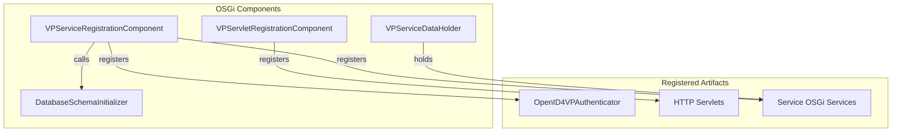

**VPServiceDataHolder Pattern:**
```java
// Singleton holding service references
VPServiceDataHolder.getInstance().getVPRequestService()
VPServiceDataHolder.getInstance().getVPSubmissionService()
VPServiceDataHolder.getInstance().getPresentationDefinitionService()
// ... etc
```

---

## Complete Request Flow

### VP Authentication Flow (End-to-End)

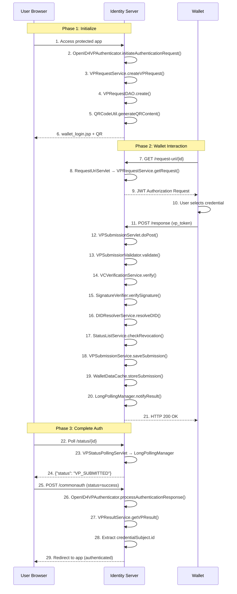

---

## Exception Flow

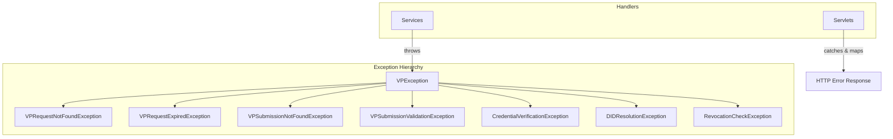

**Exception → HTTP Mapping:**

| Exception | HTTP Status | Error Code |
|-----------|-------------|------------|
| `VPRequestNotFoundException` | 404 | `request_not_found` |
| `VPRequestExpiredException` | 400 | `expired_request` |
| `VPSubmissionValidationException` | 400 | `invalid_presentation` |
| `CredentialVerificationException` | 400 | `invalid_proof` |
| `DIDResolutionException` | 502 | `server_error` |
| `RevocationCheckException` | 400 | `credential_revoked` |

---

## Summary

| Layer | Components | Responsibility |
|-------|------------|----------------|
| **Entry** | Authenticator, Servlets | HTTP/Auth framework integration |
| **Business** | Services, Handlers | Core logic, verification |
| **State** | Cache, Polling | Real-time coordination |
| **Persistence** | DAO | Database operations |
| **Support** | Util, Exception, Constant | Helpers, errors, config |
| **Infrastructure** | Internal | OSGi lifecycle |
