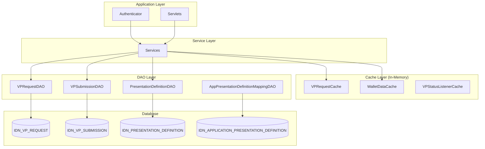
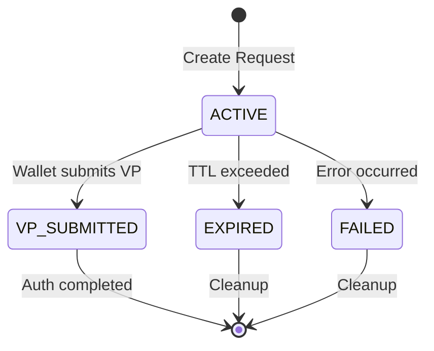
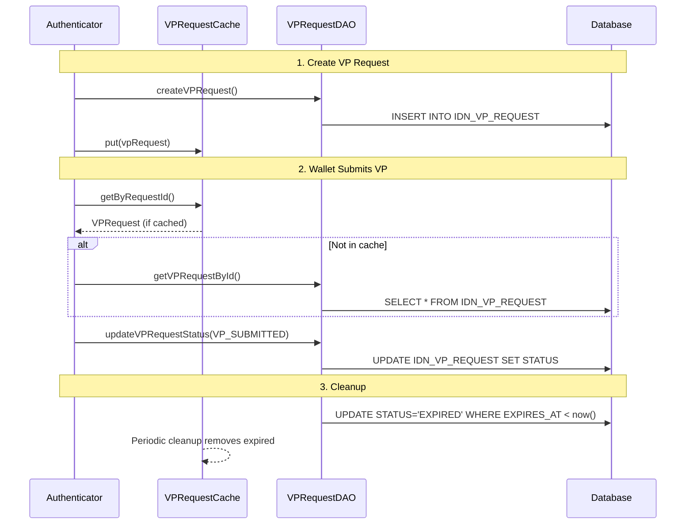
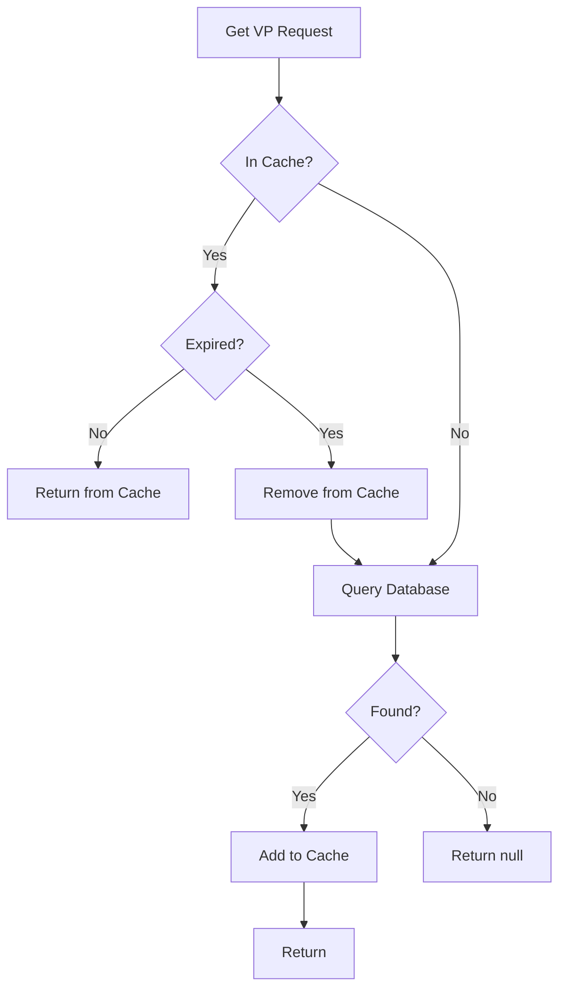

# Data Storage and Caching in OpenID4VP Implementation

This document explains how data is stored in database tables, how records are deleted/expired, and how the caching layer works.

---

## Overview



---

## Database Tables

### Table 1: IDN_VP_REQUEST

**Purpose:** Stores VP (Verifiable Presentation) authorization requests created when users initiate OpenID4VP authentication.

**Schema:**
```sql
CREATE TABLE IDN_VP_REQUEST (
    ID INTEGER AUTO_INCREMENT,
    REQUEST_ID VARCHAR(255) NOT NULL,        -- Unique request identifier (UUID)
    TRANSACTION_ID VARCHAR(255) NOT NULL,    -- Transaction correlation ID
    CLIENT_ID VARCHAR(255) NOT NULL,         -- Verifier client ID (DID)
    NONCE VARCHAR(255) NOT NULL,             -- Replay protection
    PRESENTATION_DEFINITION_ID VARCHAR(255), -- Reference to presentation definition
    PRESENTATION_DEFINITION CLOB,            -- Inline definition JSON
    RESPONSE_URI VARCHAR(2048),              -- Callback URL for response
    RESPONSE_MODE VARCHAR(50),               -- 'direct_post' or 'direct_post.jwt'
    REQUEST_JWT CLOB,                        -- Signed JWT request object
    STATUS VARCHAR(50) NOT NULL,             -- ACTIVE, VP_SUBMITTED, EXPIRED, FAILED
    CREATED_AT BIGINT NOT NULL,              -- Creation timestamp (epoch ms)
    EXPIRES_AT BIGINT NOT NULL,              -- Expiry timestamp (epoch ms)
    TENANT_ID INTEGER DEFAULT -1234,         -- Multi-tenant support
    PRIMARY KEY (ID),
    UNIQUE (REQUEST_ID, TENANT_ID),
    UNIQUE (TRANSACTION_ID, TENANT_ID)
);
```

**Indexes:**
| Index | Purpose |
|-------|---------|
| `IDX_VP_REQ_TRANSACTION_ID` | Fast lookup by transaction ID |
| `IDX_VP_REQ_STATUS` | Query by status (for cleanup) |
| `IDX_VP_REQ_EXPIRES` | Find expired requests |
| `IDX_VP_REQ_CLIENT_ID` | Filter by client |

---

### Table 2: IDN_VP_SUBMISSION

**Purpose:** Stores VP submissions (responses from wallets) containing `vp_token` and verification results.

**Schema:**
```sql
CREATE TABLE IDN_VP_SUBMISSION (
    ID INTEGER AUTO_INCREMENT,
    SUBMISSION_ID VARCHAR(255) NOT NULL,      -- Unique submission ID
    REQUEST_ID VARCHAR(255) NOT NULL,         -- FK to VP_REQUEST
    VP_TOKEN CLOB,                            -- JWT VP token from wallet
    PRESENTATION_SUBMISSION CLOB,             -- DIF presentation submission JSON
    ERROR VARCHAR(255),                       -- Error code if failed
    ERROR_DESCRIPTION CLOB,                   -- Error details
    VERIFICATION_STATUS VARCHAR(50),          -- VERIFIED, FAILED, PENDING
    VERIFICATION_RESULT CLOB,                 -- Detailed verification result JSON
    SUBMITTED_AT BIGINT NOT NULL,             -- Submission timestamp
    TENANT_ID INTEGER DEFAULT -1234,
    PRIMARY KEY (ID),
    UNIQUE (SUBMISSION_ID, TENANT_ID)
);
```

**Indexes:**
| Index | Purpose |
|-------|---------|
| `IDX_VP_SUB_REQUEST_ID` | Find submissions by request |
| `IDX_VP_SUB_VERIFICATION` | Filter by verification status |

---

### Table 3: IDN_PRESENTATION_DEFINITION

**Purpose:** Stores presentation definition templates that specify what credentials to request.

**Schema:**
```sql
CREATE TABLE IDN_PRESENTATION_DEFINITION (
    ID INTEGER AUTO_INCREMENT,
    DEFINITION_ID VARCHAR(255) NOT NULL,      -- Unique definition ID
    NAME VARCHAR(255) NOT NULL,               -- Human-readable name
    DESCRIPTION CLOB,                         -- Description
    DEFINITION_JSON CLOB NOT NULL,            -- Full definition JSON
    IS_DEFAULT BOOLEAN DEFAULT FALSE,         -- Default for tenant
    CREATED_AT BIGINT NOT NULL,
    UPDATED_AT BIGINT,
    TENANT_ID INTEGER DEFAULT -1234,
    PRIMARY KEY (ID),
    UNIQUE (DEFINITION_ID, TENANT_ID),
    UNIQUE (NAME, TENANT_ID)
);
```

---

### Table 4: IDN_APPLICATION_PRESENTATION_DEFINITION

**Purpose:** Maps applications to their configured presentation definitions.

**Schema:**
```sql
CREATE TABLE IDN_APPLICATION_PRESENTATION_DEFINITION (
    ID INTEGER AUTO_INCREMENT,
    APPLICATION_ID VARCHAR(255) NOT NULL,     -- SP/App UUID
    PRESENTATION_DEFINITION_ID VARCHAR(255),  -- FK to definition
    TENANT_ID INTEGER DEFAULT -1234,
    CREATED_AT BIGINT NOT NULL,
    UPDATED_AT BIGINT,
    PRIMARY KEY (ID),
    UNIQUE (APPLICATION_ID, TENANT_ID)
);
```

---

## Data Lifecycle

### VP Request Lifecycle



### Data Flow



---

## DAO Operations Summary

### VPRequestDAO

| Method | SQL Operation | Purpose |
|--------|--------------|---------|
| `createVPRequest()` | `INSERT INTO IDN_VP_REQUEST` | Create new request |
| `getVPRequestById()` | `SELECT WHERE REQUEST_ID = ?` | Get by request ID |
| `getVPRequestByTransactionId()` | `SELECT WHERE TRANSACTION_ID = ?` | Get by transaction |
| `updateVPRequestStatus()` | `UPDATE SET STATUS = ?` | Update status |
| `deleteVPRequest()` | `DELETE WHERE REQUEST_ID = ?` | Delete request |
| `getExpiredVPRequests()` | `SELECT WHERE EXPIRES_AT < ? AND STATUS = 'ACTIVE'` | Find expired |
| `markExpiredRequests()` | `UPDATE SET STATUS = 'EXPIRED' WHERE EXPIRES_AT < ?` | Bulk expire |

### VPSubmissionDAO

| Method | SQL Operation | Purpose |
|--------|--------------|---------|
| `createVPSubmission()` | `INSERT INTO IDN_VP_SUBMISSION` | Store wallet response |
| `getSubmissionByRequestId()` | `SELECT WHERE REQUEST_ID = ?` | Get by request |
| `updateVerificationStatus()` | `UPDATE SET VERIFICATION_STATUS = ?` | Update verification |
| `deleteSubmissionsByRequestId()` | `DELETE WHERE REQUEST_ID = ?` | Cleanup |

---

## Data Deletion Strategies

### Automatic Expiration

| Mechanism | Component | Trigger |
|-----------|-----------|---------|
| Status Update | `VPRequestDAO.markExpiredRequests()` | Can be called periodically |
| Cache TTL | `VPRequestCache.cleanup()` | Every 1 minute |
| Cache TTL | `WalletDataCache.startCleanupTask()` | Every 1 minute |

### Manual Deletion

```java
// Delete specific request
vpRequestDAO.deleteVPRequest(requestId, tenantId);

// Delete all expired requests
vpRequestDAO.markExpiredRequests(tenantId);

// Clear cache entry
VPRequestCache.getInstance().remove(requestId);
WalletDataCache.getInstance().clear();
```

### Cascade Considerations

> [!WARNING]
> Deleting a VP request does NOT automatically delete its submissions.
> You must delete submissions first to maintain data integrity.

```java
// Proper cleanup order
vpSubmissionDAO.deleteSubmissionsByRequestId(requestId, tenantId);
vpRequestDAO.deleteVPRequest(requestId, tenantId);
```

---

## Caching Layer

### Cache Classes

| Cache | Data Stored | TTL | Cleanup Interval |
|-------|-------------|-----|------------------|
| `VPRequestCache` | VPRequest objects | Configurable (default 5 min) | 1 minute |
| `WalletDataCache` | VP tokens, Submissions, AuthContext | 5 minutes | 1 minute |
| `VPStatusListenerCache` | Polling listeners | Session duration | Manual |

---

### VPRequestCache

**Purpose:** Fast access to active VP requests during authentication flow.

**Implementation:**
- Singleton pattern
- `ConcurrentHashMap<String, VPRequestCacheEntry>`
- Dual-key lookup: requestId and transactionId
- TTL-based expiration
- Size limit with LRU eviction

**Key Methods:**

| Method | Description |
|--------|-------------|
| `put(vpRequest)` | Add request to cache |
| `getByRequestId(id)` | Get by request ID |
| `getByTransactionId(id)` | Get by transaction ID |
| `remove(requestId)` | Remove from cache |
| `clear()` | Clear entire cache |

**Internal Structure:**
```java
// Primary cache
Map<String, VPRequestCacheEntry> cacheByRequestId;

// Secondary index for transaction lookup
Map<String, String> transactionToRequestIdMap;

// Cache entry with TTL
class VPRequestCacheEntry {
    VPRequest vpRequest;
    long createdAt;
    long expiresAt;
    
    boolean isExpired() {
        return System.currentTimeMillis() > expiresAt;
    }
}
```

**Cleanup Mechanism:**
```java
// Scheduled every 1 minute
cleanupExecutor.scheduleAtFixedRate(this::cleanup, 1, 1, TimeUnit.MINUTES);

private void cleanup() {
    Iterator<Entry> iterator = cache.entrySet().iterator();
    while (iterator.hasNext()) {
        if (entry.getValue().isExpired()) {
            iterator.remove();
        }
    }
}
```

---

### WalletDataCache

**Purpose:** Store temporary data during wallet interaction (VP tokens, submissions, auth context).

**Implementation:**
- Singleton pattern
- Three separate `ConcurrentHashMap` caches:
  - `tokenCache` - VP tokens keyed by state
  - `submissionCache` - VPSubmission objects keyed by requestId
  - `contextCache` - AuthenticationContext keyed by sessionDataKey

**Key Methods:**

| Method | Data Type | Description |
|--------|-----------|-------------|
| `storeToken(state, vpToken)` | String | Store VP token |
| `retrieveToken(state)` | String | Get and remove token (single-use) |
| `hasToken(state)` | boolean | Check if token exists |
| `storeSubmission(requestId, submission)` | VPSubmission | Store wallet submission |
| `getSubmission(requestId)` | VPSubmission | Get without removing |
| `retrieveSubmission(requestId)` | VPSubmission | Get and remove (single-use) |
| `storeContext(sessionDataKey, context)` | AuthContext | Store auth context |
| `getContext(sessionDataKey)` | AuthContext | Get auth context |

**TTL Configuration:**
```java
private static final long DEFAULT_TTL_MINUTES = 5;
private static final long CLEANUP_INTERVAL_MINUTES = 1;
```

---

### VPStatusListenerCache

**Purpose:** Manage long-polling listeners waiting for wallet responses.

**Used by:** `LongPollingManager`, `VPStatusPollingServlet`

**Key Methods:**

| Method | Description |
|--------|-------------|
| `addListener(requestId, listener)` | Register polling listener |
| `removeListener(requestId)` | Unregister listener |
| `notifyListener(requestId, result)` | Notify listener of result |

---

## Cache vs Database Strategy



**Read Strategy:**
1. Check cache first (O(1) lookup)
2. If not found or expired, query database
3. Cache database result for future reads

**Write Strategy:**
1. Always write to database first (persistence)
2. Update cache after successful DB write

---

## Configuration

**Default Values (from `OpenID4VPConstants`):**

| Parameter | Default Value | Description |
|-----------|--------------|-------------|
| `CACHE_ENTRY_EXPIRY_SECONDS` | 300 (5 min) | Cache TTL |
| `MAX_CACHE_ENTRIES` | 10000 | Maximum cache size |
| `VP_REQUEST_EXPIRY_SECONDS` | 300 (5 min) | Request validity period |

---

## Monitoring & Debugging

**Cache Statistics:**
```java
// Get cache sizes
int requestCacheSize = VPRequestCache.getInstance().size();
int tokenCacheSize = WalletDataCache.getInstance().size();
int submissionCacheSize = WalletDataCache.getInstance().submissionSize();
```

**Database Queries for Monitoring:**
```sql
-- Active requests count
SELECT COUNT(*) FROM IDN_VP_REQUEST WHERE STATUS = 'ACTIVE';

-- Expired requests (not yet marked)
SELECT COUNT(*) FROM IDN_VP_REQUEST 
WHERE EXPIRES_AT < CURRENT_TIMESTAMP AND STATUS = 'ACTIVE';

-- Submissions by status
SELECT VERIFICATION_STATUS, COUNT(*) 
FROM IDN_VP_SUBMISSION 
GROUP BY VERIFICATION_STATUS;
```
