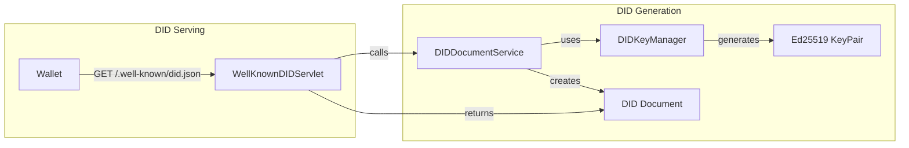
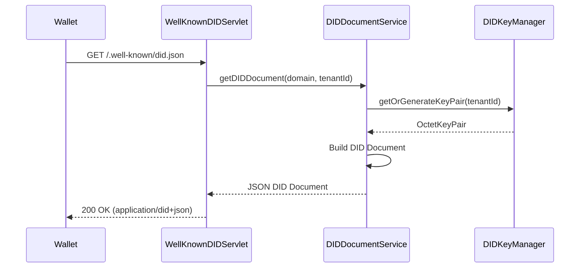
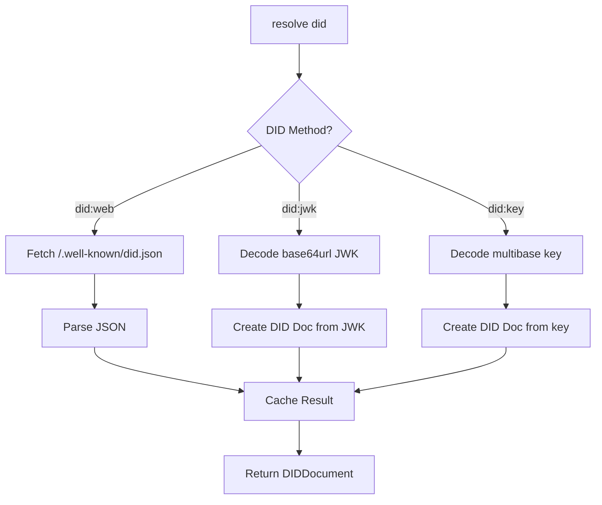
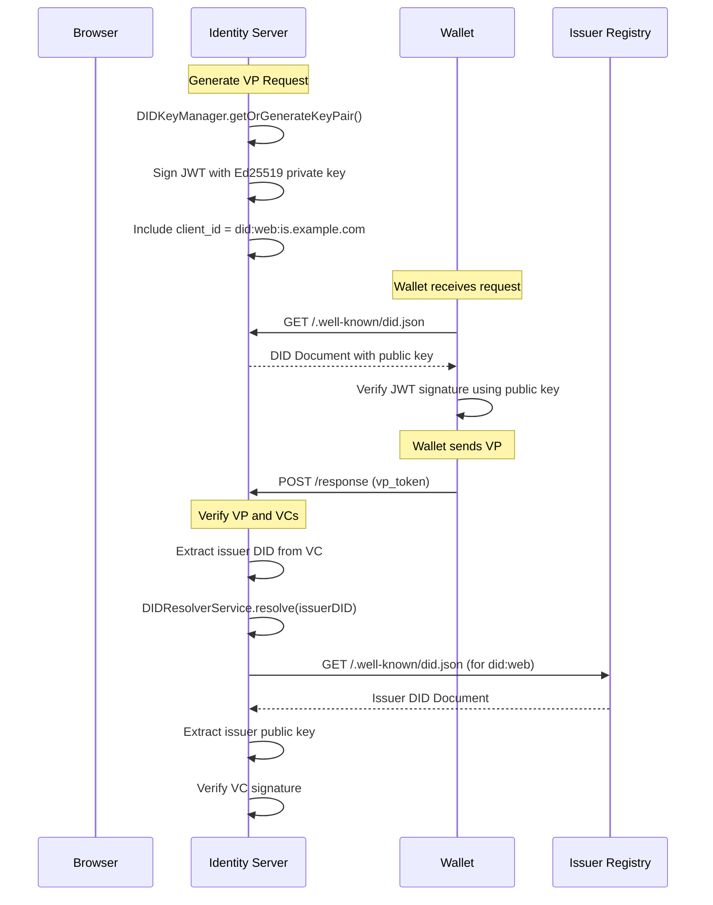
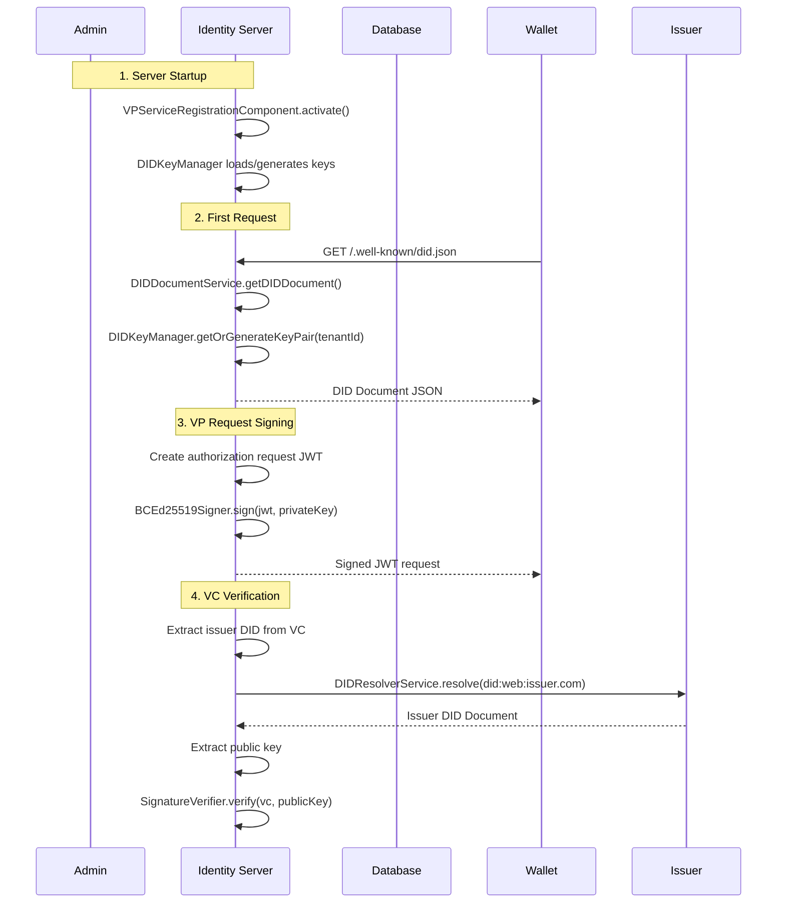

# DID Handling in OpenID4VP Implementation

This document explains how Decentralized Identifiers (DIDs) are created, stored, resolved, and used in the WSO2 OpenID4VP implementation.

---

## Overview

The OpenID4VP implementation handles two types of DIDs:

| Type | Purpose | Component |
|------|---------|-----------|
| **Verifier DID** | Identity of WSO2 IS as a verifier | `DIDDocumentService`, `DIDKeyManager` |
| **External DIDs** | Issuer/Holder DIDs from VCs | `DIDResolverService` |

---

## 1. Verifier DID (did:web)

WSO2 Identity Server acts as a **Verifier** in the OID4VP flow. It needs its own DID to sign authorization requests and for wallets to verify the verifier's identity.

### Architecture



### Key Generation (`DIDKeyManager.java`)

**Location:** `util/DIDKeyManager.java`

**Key Type:** Ed25519 (EdDSA)

**Current Implementation:**
```java
// Uses a FIXED Ed25519 key pair for consistency
// In production, this should be dynamically generated and stored
private static com.nimbusds.jose.jwk.OctetKeyPair generateEd25519KeyPair() {
    // Fixed key for testing
    Base64URL d = new Base64URL("YZIGkDMQP67xxjqMXQ0QnYN_9ehW8k0tD7uOWwqXtGo"); // private
    Base64URL x = new Base64URL("kAYP8zpwH-gO7lHegu-9urMxRspJPKIMCREHCFI6HXM"); // public
    
    return new OctetKeyPair.Builder(Curve.Ed25519, x).d(d).build();
}
```

**Key Storage:**

| Storage Type | Location | Status |
|-------------|----------|--------|
| In-Memory Cache | `ConcurrentHashMap<Integer, OctetKeyPair>` per tenant | ✅ Current |
| Database | Not implemented | ❌ Future |
| HSM/Keystore | Not implemented | ❌ Future |

**Key Methods:**

| Method | Purpose |
|--------|---------|
| `getOrGenerateKeyPair(tenantId)` | Get cached or generate new key pair |
| `regenerateKeyPair(tenantId)` | Force regeneration of keys |
| `publicKeyToMultibase(keyPair)` | Convert to multibase format for DID document |
| `publicKeyToJwkMap(keyPair)` | Convert to JWK format |

### DID Document Generation (`DIDDocumentServiceImpl.java`)

**Location:** `service/impl/DIDDocumentServiceImpl.java`

**DID Method:** `did:web`

**DID Format:**
```
did:web:{domain}
did:web:localhost%3A9443  (for local dev with port)
```

**Generated DID Document Structure:**
```json
{
  "@context": [
    "https://www.w3.org/ns/did/v1",
    "https://w3id.org/security/suites/ed25519-2020/v1"
  ],
  "id": "did:web:localhost%3A9443",
  "verificationMethod": [{
    "id": "did:web:localhost%3A9443#owner",
    "type": "Ed25519VerificationKey2020",
    "controller": "did:web:localhost%3A9443",
    "publicKeyMultibase": "z6Mk..."
  }],
  "authentication": ["did:web:localhost%3A9443#owner"],
  "assertionMethod": ["did:web:localhost%3A9443#owner"]
}
```

**Key Methods:**

| Method | Purpose |
|--------|---------|
| `getDIDDocument(domain, tenantId)` | Generate DID document as JSON string |
| `getDIDDocumentObject(domain, tenantId)` | Generate DID document as object |
| `getDID(domain)` | Convert domain to `did:web:` format |
| `regenerateKeys(domain, tenantId)` | Regenerate keys and return new document |

### Serving DID Document (`WellKnownDIDServlet.java`)

**Location:** `servlet/WellKnownDIDServlet.java`

**Endpoint:** `GET /.well-known/did.json`

**Flow:**


---

## 2. External DID Resolution

When verifying VCs, the verifier needs to resolve issuer DIDs to get their public keys for signature verification.

### Supported DID Methods

| Method | Resolution Strategy | Example |
|--------|---------------------|---------|
| `did:web` | HTTP fetch from `/.well-known/did.json` | `did:web:example.com` → `https://example.com/.well-known/did.json` |
| `did:jwk` | JWK embedded in DID itself | `did:jwk:eyJrdHkiOiJPS1AiLCJ...` |
| `did:key` | Public key encoded in DID | `did:key:z6Mk...` |

### DID Resolver (`DIDResolverServiceImpl.java`)

**Location:** `service/impl/DIDResolverServiceImpl.java`

**Resolution Flow:**


**did:web Resolution:**
```
did:web:example.com → https://example.com/.well-known/did.json
did:web:example.com:path:to:doc → https://example.com/path/to/doc/did.json
did:web:localhost%3A9443 → https://localhost:9443/.well-known/did.json
```

**did:key Resolution:**
```
did:key:z6MkhaX... → Decode multibase, extract Ed25519 public key
```

The `z` prefix indicates base58btc encoding. The first 2 bytes are the multicodec prefix:
- `0xed01` → Ed25519 public key
- `0x1200` → secp256k1 public key
- `0x1201` → P-256 public key

### Caching

| Parameter | Value |
|-----------|-------|
| Cache TTL | 1 hour (3600000 ms) |
| Cache Key | Full DID string |
| Cache Type | `ConcurrentHashMap` |

### Key Extraction

The resolver can extract public keys from multiple formats:

| Format | Field | Example |
|--------|-------|---------|
| JWK | `publicKeyJwk` | `{"kty": "OKP", "crv": "Ed25519", "x": "..."}` |
| Multibase | `publicKeyMultibase` | `z6MkhaX...` |
| Base58 | `publicKeyBase58` | `4J5qKb...` |

---

## 3. DID Usage in Authentication Flow



---

## 4. Classes Summary

| Class | Package | Purpose |
|-------|---------|---------|
| `DIDKeyManager` | `util` | Ed25519 key generation and caching |
| `BCEd25519Signer` | `util` | Sign JWTs using Ed25519 keys |
| `DIDDocumentService` | `service` | Interface for DID document operations |
| `DIDDocumentServiceImpl` | `service.impl` | Generate verifier DID documents |
| `DIDResolverService` | `service` | Interface for DID resolution |
| `DIDResolverServiceImpl` | `service.impl` | Resolve external DIDs |
| `WellKnownDIDServlet` | `servlet` | Serve DID document at `/.well-known/did.json` |
| `DIDDocument` | `model` | DID document model class |
| `DIDDocumentException` | `exception` | DID document generation errors |
| `DIDResolutionException` | `exception` | DID resolution errors |

---

## 5. Configuration

**deployment.toml:**
```toml
[OpenID4VP]
BaseUrl = "https://localhost:9443"

[OpenID4VP.DID]
Method = "web"
UniversalResolverUrl = "https://dev.uniresolver.io/1.0/identifiers/"
```

---

## 6. Current Limitations & Future Work

| Limitation | Current | Future |
|------------|---------|--------|
| Key Storage | In-memory (fixed key) | Database/HSM/Keystore |
| Key Rotation | Manual | Automated rotation |
| did:ion/did:ethr | Not supported | Add support |
| Universal Resolver | Not integrated | Integrate for unknown methods |
| Multi-tenant Keys | Same key for all | Per-tenant key pairs |

---

## 7. Sequence: Complete DID Lifecycle


