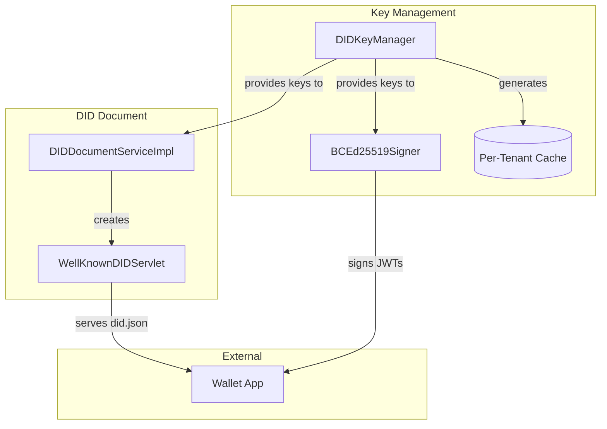
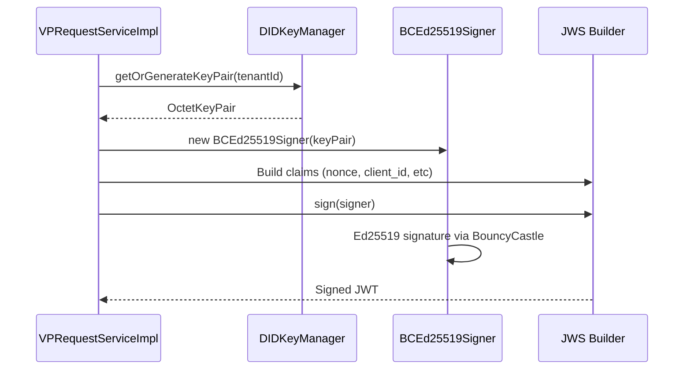

# DID Key Handling Implementation

This document explains how DIDs (Decentralized Identifiers) and cryptographic keys are managed in the OpenID4VP implementation.

---

## Architecture Overview



---

## Key Components

| Component | File | Purpose |
|-----------|------|---------|
| `DIDKeyManager` | `util/DIDKeyManager.java` | Ed25519 key generation and caching |
| `BCEd25519Signer` | `util/BCEd25519Signer.java` | JWT signing using Bouncy Castle |
| `DIDDocumentServiceImpl` | `service/impl/DIDDocumentServiceImpl.java` | DID document generation |
| `WellKnownDIDServlet` | `servlet/WellKnownDIDServlet.java` | Exposes `/.well-known/did.json` |

---

## Supported Algorithm

| Algorithm | Curve | Key Type | Format |
|-----------|-------|----------|--------|
| **EdDSA** | Ed25519 | `OKP` (Octet Key Pair) | JWK / Multibase |

> [!NOTE]
> Currently only Ed25519 is supported. ECDSA (P-256) and RSA are not implemented.

---

## Key Generation

### Current Implementation (Fixed Test Key)

```java
// DIDKeyManager.java - generateEd25519KeyPair()
// Uses FIXED key pair for testing consistency

com.nimbusds.jose.util.Base64URL d = new Base64URL(
    "YZIGkDMQP67xxjqMXQ0QnYN_9ehW8k0tD7uOWwqXtGo");  // Private key
com.nimbusds.jose.util.Base64URL x = new Base64URL(
    "kAYP8zpwH-gO7lHegu-9urMxRspJPKIMCREHCFI6HXM");  // Public key

return new OctetKeyPair.Builder(Curve.Ed25519, x)
    .d(d)
    .build();
```

> [!CAUTION]
> This uses a **hardcoded test key**. For production, implement proper key generation and secure storage.

### Per-Tenant Caching

```java
private static final ConcurrentHashMap<Integer, OctetKeyPair> keyCache = new ConcurrentHashMap<>();
```

Keys are cached per `tenantId` for multi-tenant deployments.

---

## Public Key Formats

### 1. Multibase (Ed25519VerificationKey2020)

Used in DID documents:

```
z6Mkf5rGMoatrSj1f4CyvuHBeXJELe9RPdzo2PKGNCKVtZxP
│ └────────────────────────────────────────────────────┘
│             Base58btc encoded (0xed01 + pubkey)
└─ 'z' prefix = base58btc multibase
```

**Encoding Process:**
```java
// 1. Get raw 32-byte public key
byte[] publicKeyBytes = keyPair.getX().decode();

// 2. Prepend multicodec prefix (0xed01 = Ed25519-pub)
byte[] multicodecKey = new byte[34];
multicodecKey[0] = 0xed;
multicodecKey[1] = 0x01;
System.arraycopy(publicKeyBytes, 0, multicodecKey, 2, 32);

// 3. Base58btc encode and add 'z' prefix
String multibase = "z" + base58Encode(multicodecKey);
```

### 2. JWK (JSON Web Key)

Used in JWT headers and some DID documents:

```json
{
  "kty": "OKP",
  "crv": "Ed25519",
  "x": "kAYP8zpwH-gO7lHegu-9urMxRspJPKIMCREHCFI6HXM"
}
```

---

## DID Document Structure

Generated at `/.well-known/did.json`:

```json
{
  "@context": [
    "https://www.w3.org/ns/did/v1",
    "https://w3id.org/security/suites/ed25519-2020/v1"
  ],
  "id": "did:web:localhost%3A9443",
  "verificationMethod": [{
    "id": "did:web:localhost%3A9443#owner",
    "type": "Ed25519VerificationKey2020",
    "controller": "did:web:localhost%3A9443",
    "publicKeyMultibase": "z6Mkf5rGMo..."
  }],
  "authentication": ["did:web:localhost%3A9443#owner"],
  "assertionMethod": ["did:web:localhost%3A9443#owner"]
}
```

### DID Construction

```java
// Domain: https://localhost:9443
// Step 1: Remove protocol
String cleanDomain = domain.replace("https://", "");  // localhost:9443

// Step 2: Encode port separator
cleanDomain = cleanDomain.replace(":", "%3A");        // localhost%3A9443

// Step 3: Add did:web prefix
String did = "did:web:" + cleanDomain;                // did:web:localhost%3A9443
```

---

## JWT Signing Flow



### BCEd25519Signer Implementation

```java
// Uses Bouncy Castle directly (avoids Tink dependency)
Ed25519PrivateKeyParameters privateKeyParams = 
    new Ed25519PrivateKeyParameters(privateKeyBytes, 0);

Ed25519Signer signer = new Ed25519Signer();
signer.init(true, privateKeyParams);
signer.update(signingInput, 0, signingInput.length);
byte[] signature = signer.generateSignature();
```

---

## Key Usage Summary

| Operation | Component | Key Type |
|-----------|-----------|----------|
| DID Document generation | `DIDDocumentServiceImpl` | Public (multibase) |
| JWT signing (VP Request) | `BCEd25519Signer` | Private |
| VP Token verification | `DIDResolverServiceImpl` | Public (from issuer DID) |

---

## Security Considerations

> [!WARNING]
> **Current Limitations (Test Implementation):**
> 1. Uses hardcoded test key pair
> 2. Keys stored in-memory only (lost on restart)
> 3. No key rotation mechanism
> 4. No HSM/secure storage integration

### Production Requirements

| Requirement | Current | Production |
|-------------|---------|------------|
| Key Generation | Fixed test key | Random per-tenant |
| Key Storage | In-memory cache | Database/HSM |
| Key Rotation | Not implemented | Scheduled rotation |
| Backup | None | Secure backup |
| Access Control | None | RBAC + audit |

---

## Configuration

No external configuration required currently. Keys are auto-generated on first use.

**Future enhancement (deployment.toml):**
```toml
[OpenID4VP.DID]
key_algorithm = "Ed25519"
key_storage = "database"  # or "hsm"
rotation_days = 365
```
